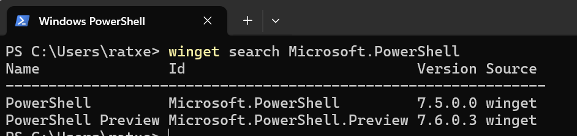
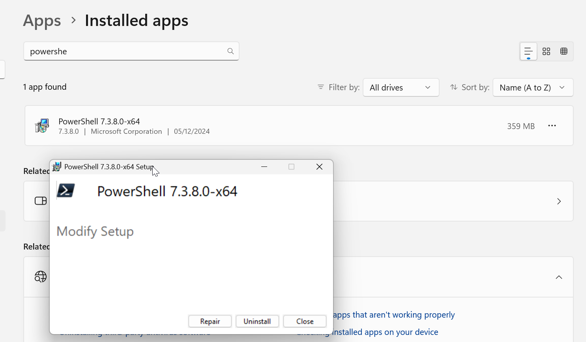
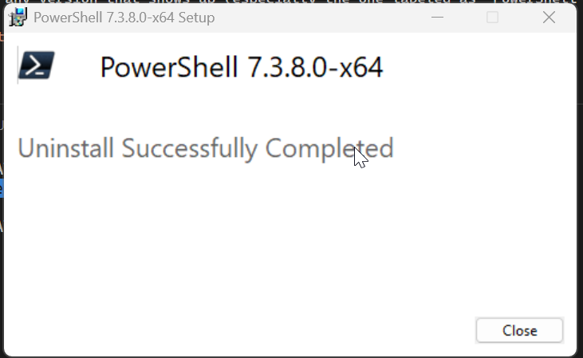
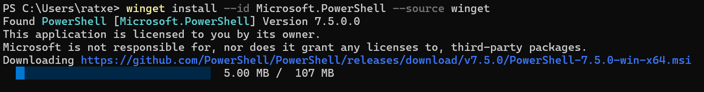
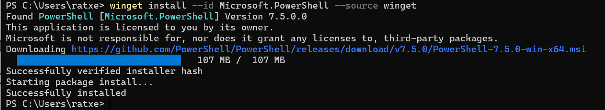
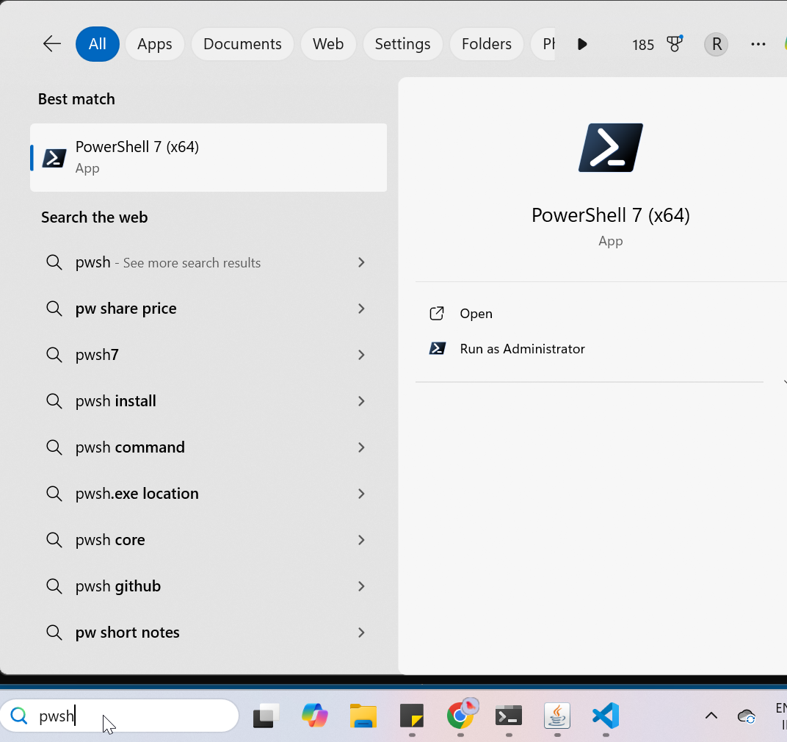
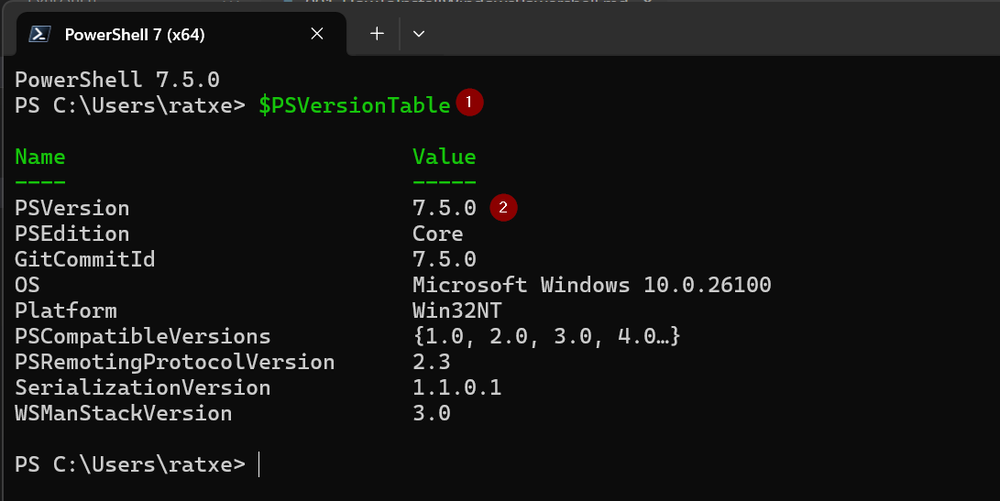

# how to install powershell 7 on windows PC

1. the link below can help.
   https://learn.microsoft.com/en-us/powershell/scripting/install/installing-powershell-on-windows?view=powershell-7.5#winget

```bash
winget search Microsoft.PowerShell
```



```bash
winget install --id Microsoft.PowerShell --source winget
```

Step 1: Uninstall Existing PowerShell
Open Settings > Apps > Installed apps.

Search for PowerShell.

Uninstall any version that shows up (especially the one labeled as "PowerShell x64" or similar).





Try again the installation after uninstallation . No need to restart the system.

```bash
winget install --id Microsoft.PowerShell --source winget
```





2. Verifying the installation ::

The reason you're still seeing **PowerShell 5.1** even after installing **PowerShell 7+** and restarting is because:

### 💡 PowerShell 7 installs **side-by-side** with Windows PowerShell 5.1

They don't overwrite each other. Here's how it works:

---

### ✅ What You’re Seeing

```powershell
$PSVersionTable
```

This is being run in **Windows PowerShell 5.1**, which is the default version bundled with Windows and located at:

```
C:\Windows\System32\WindowsPowerShell\v1.0\powershell.exe
```

---

### 🧭 How to Launch PowerShell 7

After installing PowerShell 7 via `winget`, it’s installed separately, typically here:

```
C:\Program Files\PowerShell\7\pwsh.exe
```

You can run it by:

1. Typing **`pwsh`** in your terminal (CMD, Run box, etc.).
2. Searching for **"PowerShell 7"** in the Start Menu.
3. Or run it directly:
   ```
   "C:\Program Files\PowerShell\7\pwsh.exe"
   ```

Once you're inside that shell, try:

```powershell
$PSVersionTable
```

You should now see version 7.x.

---

### 🛠 Optional: Make PowerShell 7 the Default

If you want to **make PowerShell 7 the default** when you right-click Start > Terminal or open Windows Terminal:

1. Open **Windows Terminal**.
2. Click the down arrow ▼ next to the tab + icon > **Settings**.
3. Under **Startup**, set the default profile to **PowerShell 7**.

Let me know if you want help customizing that or setting aliases!


&

```powershell
$PSVersionTable
```


