# How to create git hub project from cli

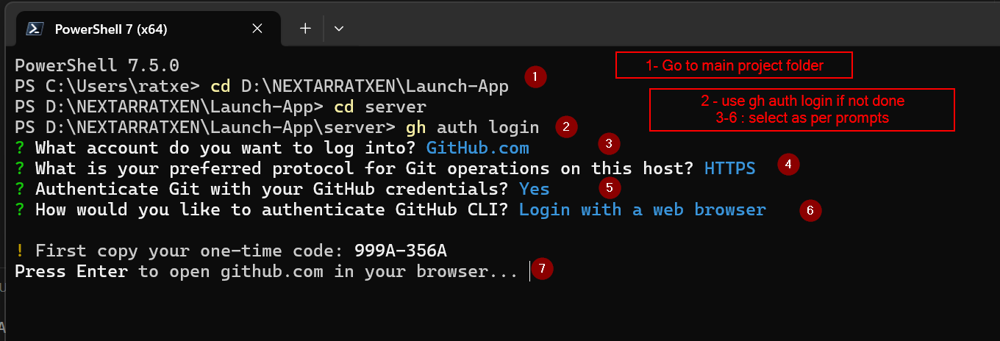

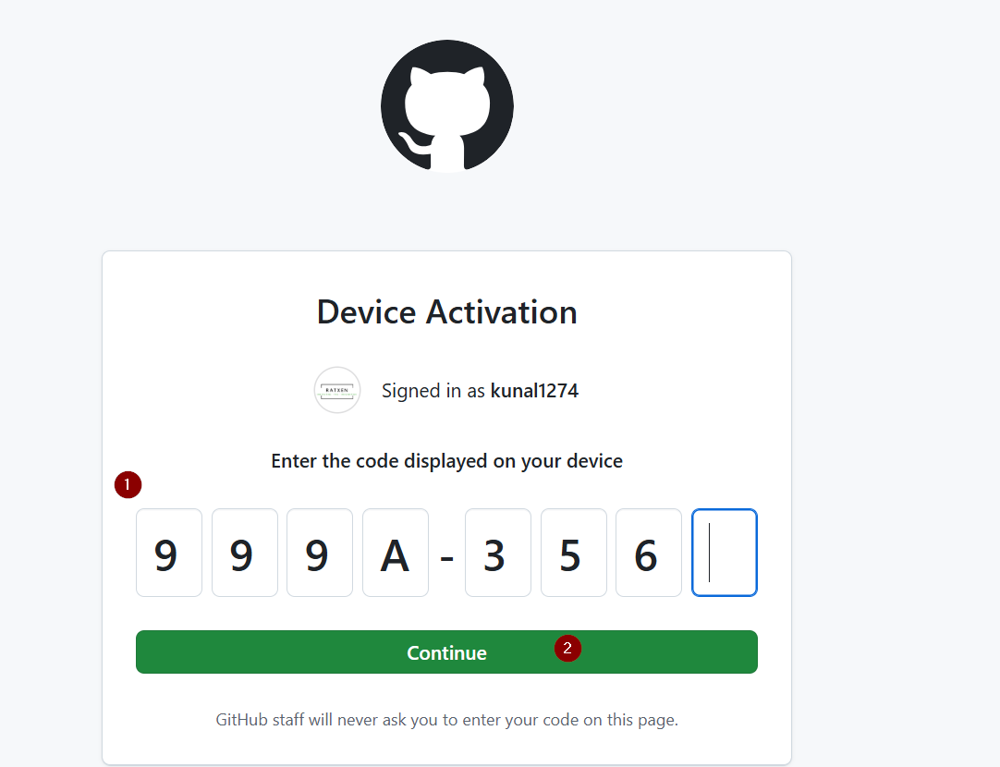

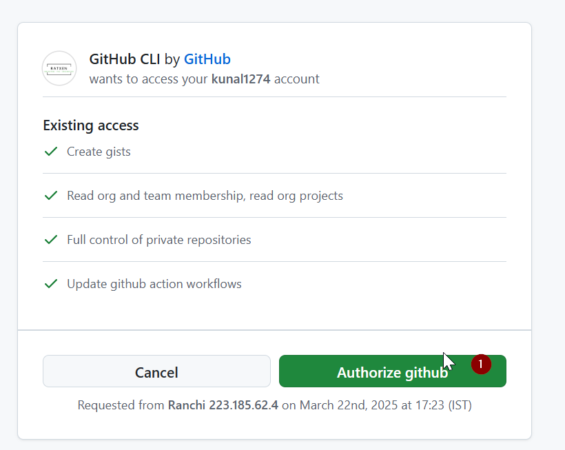

Use Passkey or password as per your convenience -

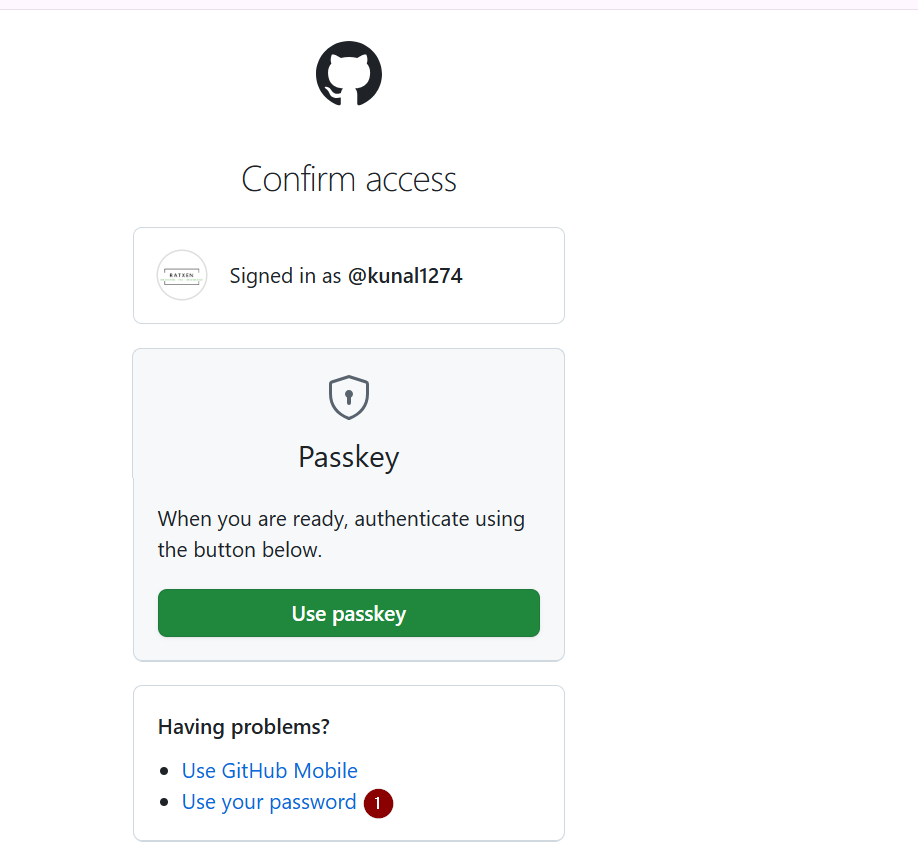

I am using password method -

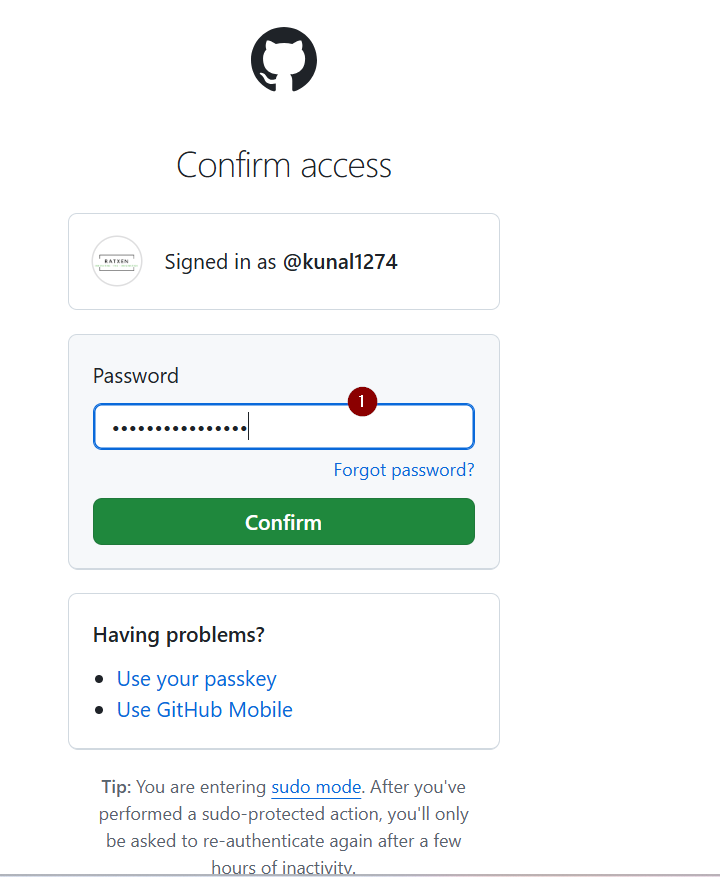

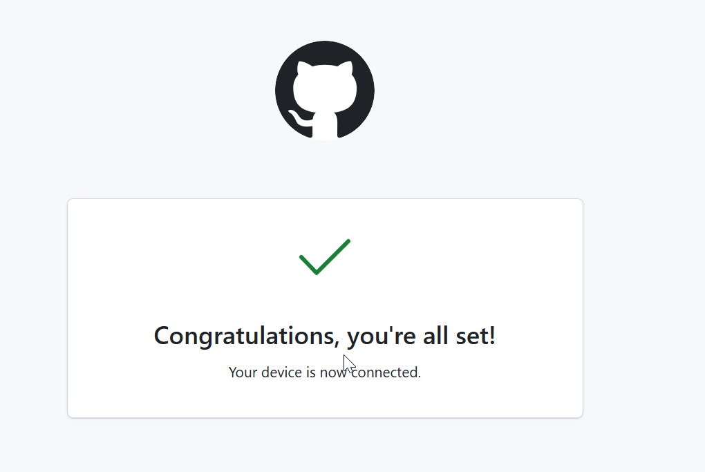

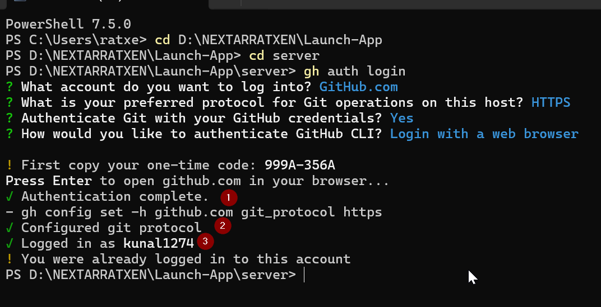

2. Initialize the repository

```bash
git init
```

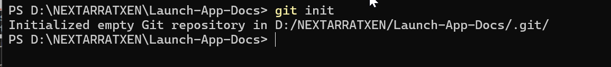

- if git is not initialized then do the following

```bash
git status
```

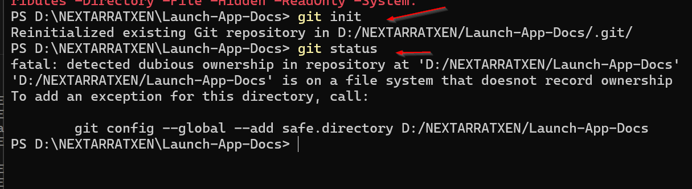

```bash
git config --global --add safe.directory D:/NEXTARRATXEN/Launch-App-Docs
```

now git init is working .
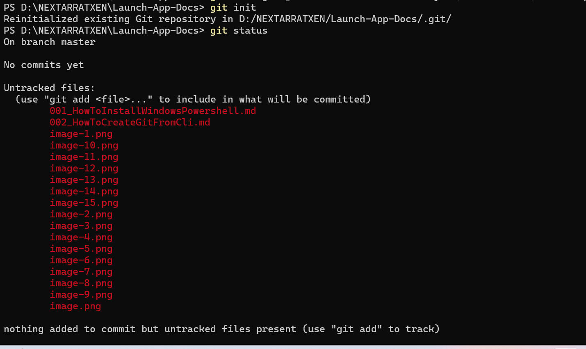

3. Now create the repository from here directly through cli.

```bash
gh repo create launch_docs --public --source=. --remote=origin
```

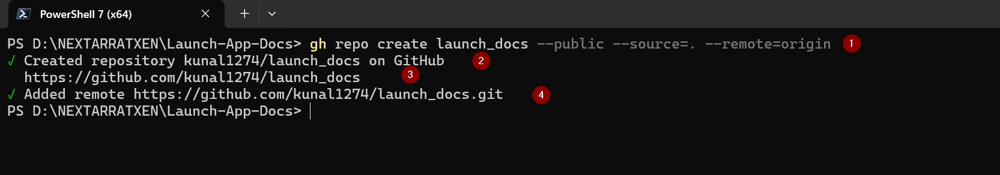
