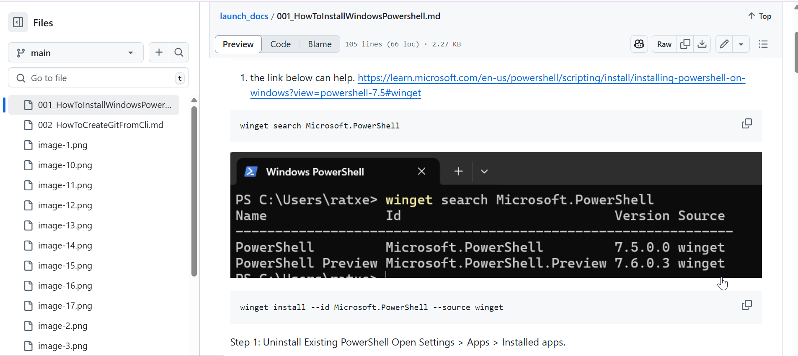

# How to create git hub project from cli


Use Passkey or password as per your convenience -


I am using password method -


2. Initialize the repository

```bash
git init
```


- if git is not initialized then do the following

```bash
git status
```


```bash
git config --global --add safe.directory D:/NEXTARRATXEN/Launch-App-Docs
```

now git init is working .


3. Now create the repository from here directly through cli.

```bash
gh repo create launch_docs --public --source=. --remote=origin
```


- To add all the files for git use git add . or else use git add file_name

```bash
git add .
```

- setting the branch name - you can use master or main branch name for production

```bash
git branch -m "main"
```

or

```bash
git branch -m "master"
```

- commit the files . before this you can check git status as well what is about to be committed.

```bash
git commit -m "Provide the name of this push or write something comments or remarks about this push to git hub"
```


checking git status again ...

```bash
git status
```


- To push the git hub use the following command

```bash
git push -u origin main
```


- the git hub project has been created and pushed to git hub account





4. pushing the files again ..

- setting the branch to uat and we will merge in git hub directly

```bash
git branch -m uat
```


- checking the status

```bash
git status
```


- adding the files to the branch

```bash
git add .
```

- committing the files

```bash
git commit -m "This is second push for remaining files and the changes in the file"
```


- checkign the status again if anything missing or not done

```bash
git status
```

- pushing the committed files to the origin of the github

```bash
git push -u origin main
```


5. now the new pull from uat to main to sync the main . this has to be done everytime whenever there is a push to uat .


- merging the pull request


- merge is closed .. please confirm


file push to uat has been now in sync with main


Now we will finally push this again to accommodate all these local changes from the last push again through uat only.

6. doing a pull..
   A patch created directly in git hub.


```bash
git pull origin main
```


pulled successfully


-- after doing the change we are doing the push again .


