# Here we will create the node js backend

1. Go to the project folder

```bash
npm init
```

or you can also use to automatically populate the details

```bash
npm init -y
```

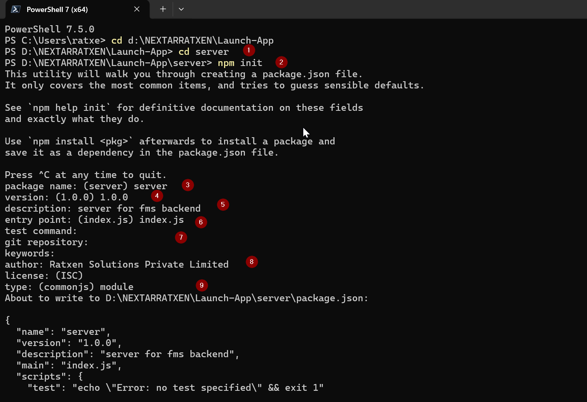

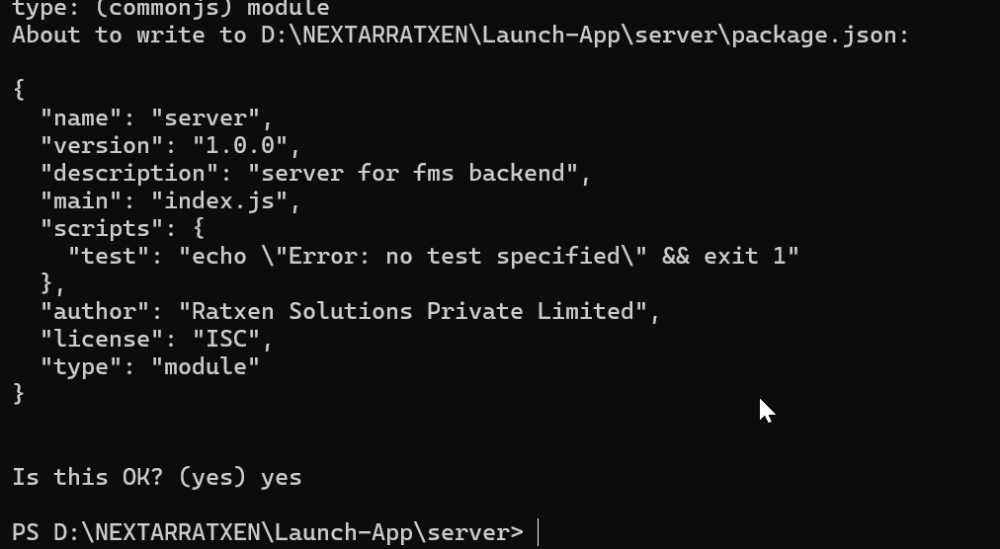

- the package.json is created

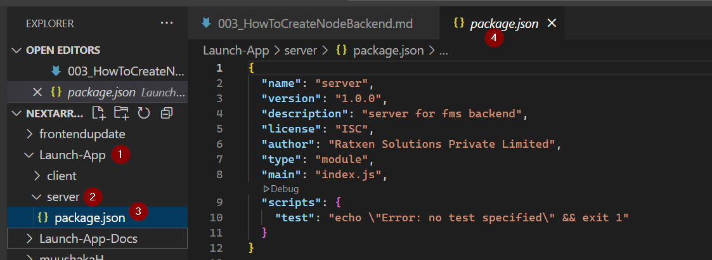
like the below -

```json
{
  "name": "server",
  "version": "1.0.0",
  "description": "server for fms backend",
  "license": "ISC",
  "author": "Ratxen Solutions Private Limited",
  "type": "module",
  "main": "index.js",
  "keywords": [],
  "scripts": {
    "test": "echo \"Error: no test specified\" && exit 1"
  }
}
```

2. trying to run the server

```bash
npm start
```

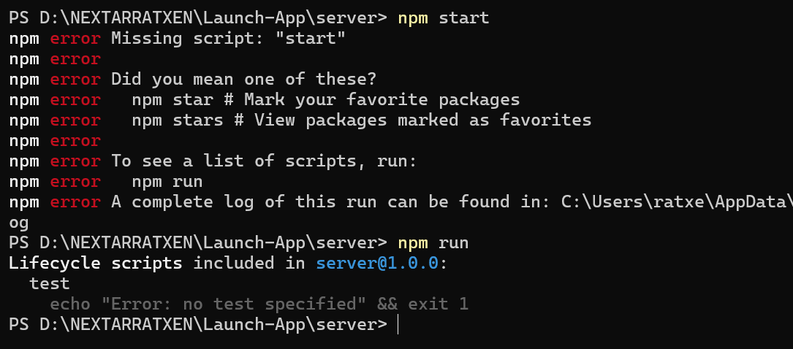

- Need to install express and also configure something on index.js

```bash
npm install express
```

or

```bash
npm i express
```

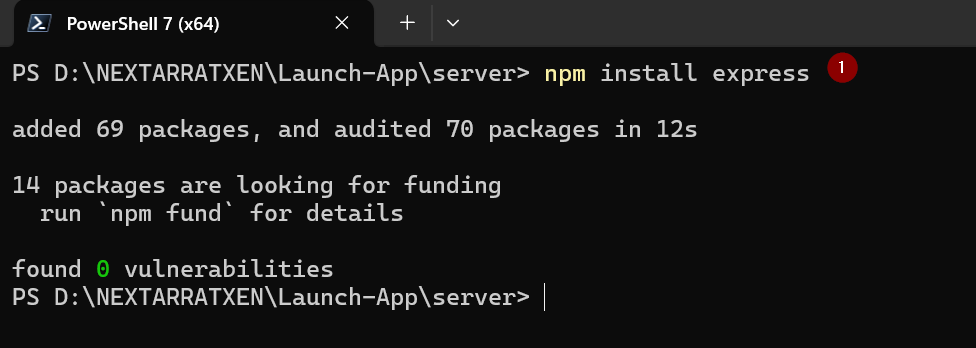

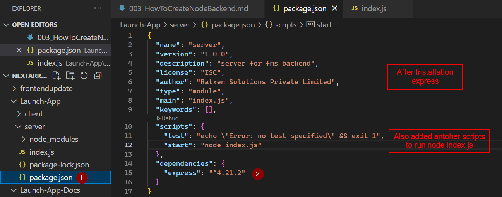

3. Create and modify the index.js file to see if the node js server is running fine or not .

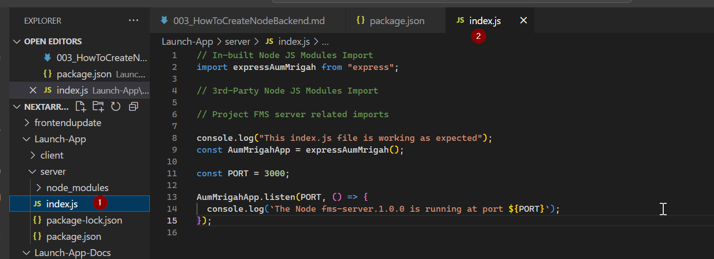

- index.js file content

```javascript
// In-built Node JS Modules Import
import expressAumMrigah from "express";

// 3rd-Party Node JS Modules Import

// Project FMS server related imports

console.log("This index.js file is working as expected");
const AumMrigahApp = expressAumMrigah();

const PORT = 3000;

AumMrigahApp.listen(PORT, () => {
  console.log(`The Node fms-server.1.0.0 is running at port ${PORT}`);
});
```

- run the server in the terminal

```bash
npm start
```

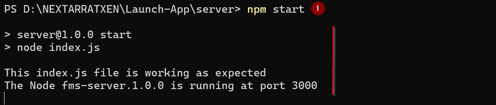

4. To push the file to git .
   go to server folder

```bash
git init
```

```bash
git config --global --add safe.directory D:/NEXTARRATXEN/Launch-App/server
```

Add .gitignore file

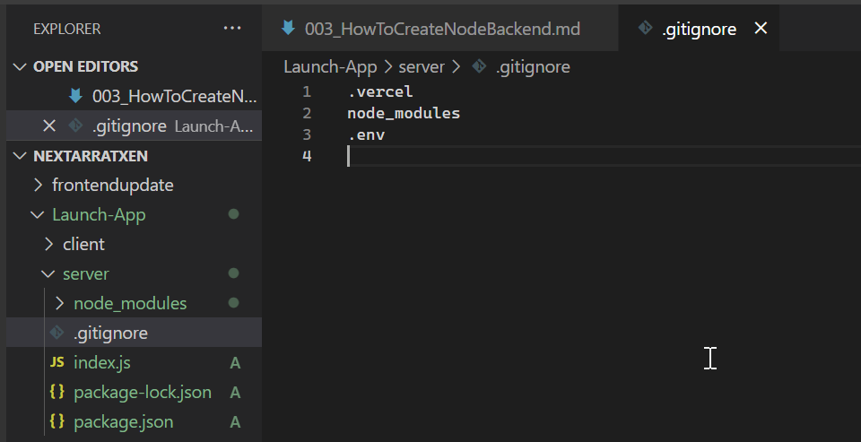

- do the git init again

```bash
git init
```

- creating the repo

```bash
gh repo create launch_app_fms --public --source=. --remote=origin
```

```bash
git branch -m main
git status
git add .
git commit -m "pushing the first to git hub for my launch-app-fms"
git push -u origin main
```

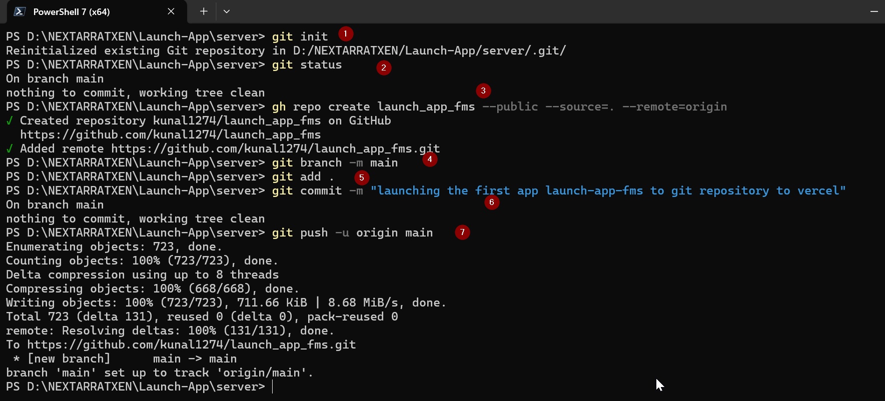

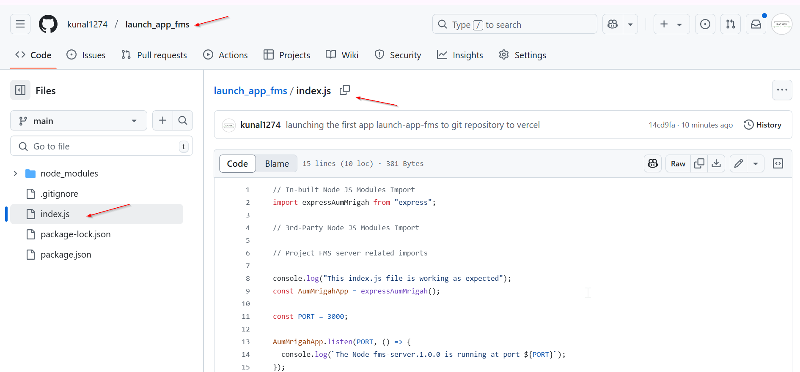

5. In case by mistake if the gitignore file was created later then you can use the below -

# 1. Remove node_modules from Git tracking

```bash
git rm -r --cached node_modules
```

# 2. Commit the removal

```bash
git commit -m "Remove node_modules from tracking"
```

# 3. Push the change

```bash
git push -u origin main
```

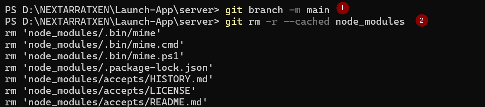

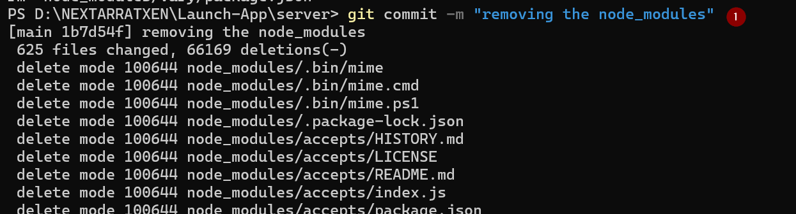

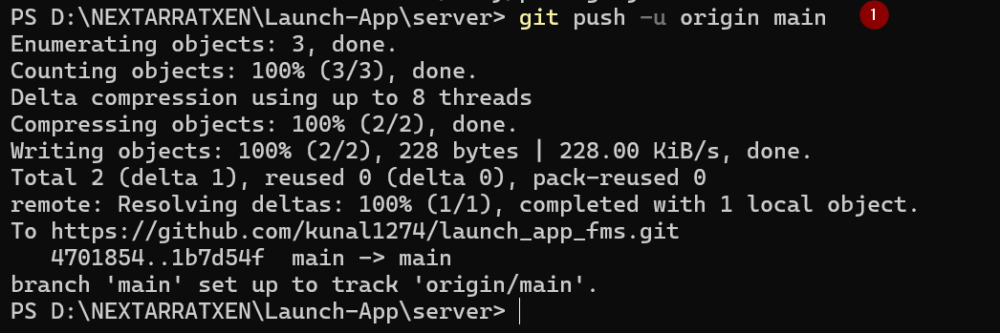

6. Modify the node backend to allow the api get to see if its working on render or any backend service.

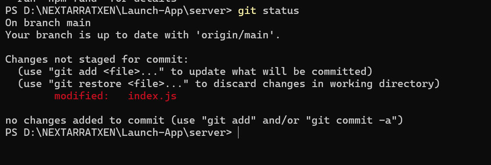

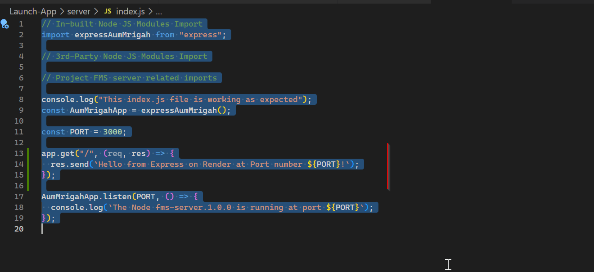

```javascript
// In-built Node JS Modules Import
import expressAumMrigah from "express";

// 3rd-Party Node JS Modules Import

// Project FMS server related imports

console.log("This index.js file is working as expected");
const AumMrigahApp = expressAumMrigah();

const PORT = 3000;

// added - start
AumMrigahApp.get("/", (req, res) => {
  res.send(`Hello from Express on Render at Port number ${PORT}!`);
});
// added - end

AumMrigahApp.listen(PORT, () => {
  console.log(`The Node fms-server.1.0.0 is running at port ${PORT}`);
});
```

with this deployment to render you can verify and confirm.
