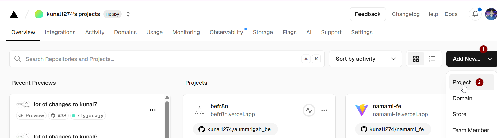
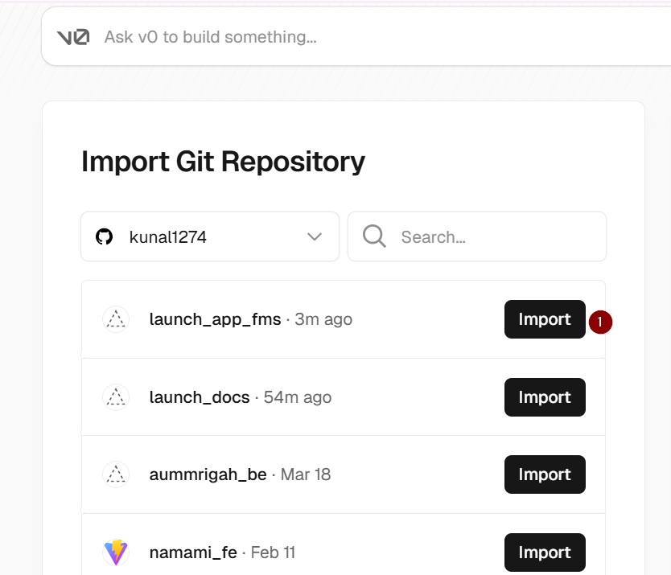
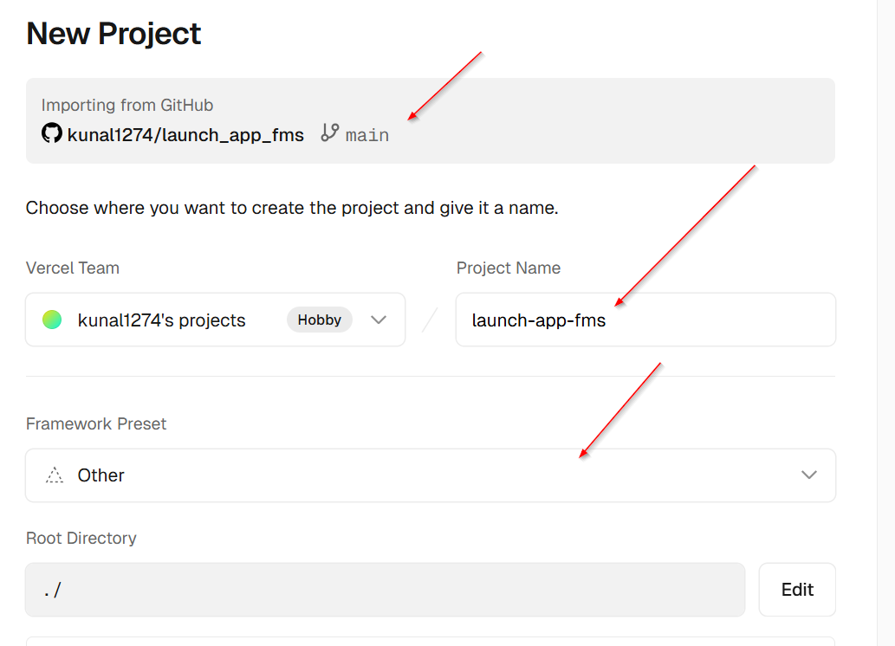
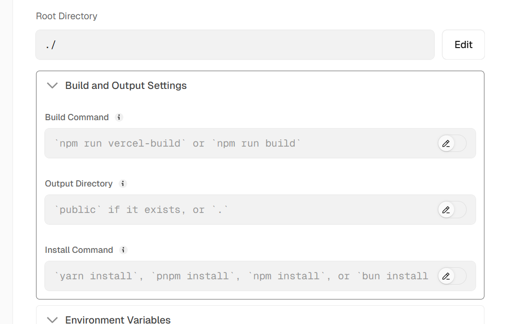
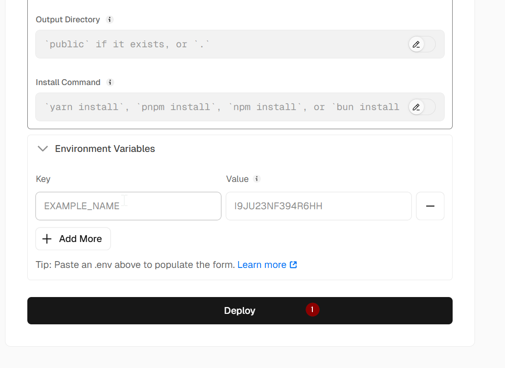
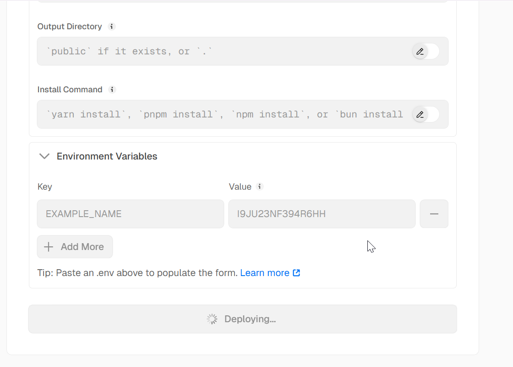
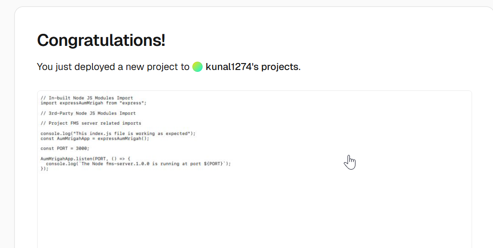
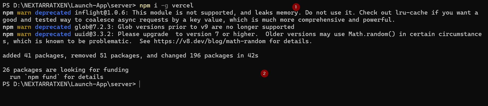

# How to deploy the project to Vercel

1. How to Create Project in Vercel



- select the project from git hub













2. But you can see the project is still not showing as what it should do .

```bash
npm i -g vercel
```



with this option we understand that deployment to vercel can be done. but node js or backend are not suitable for deployment to vercel and we will use render in another version.
