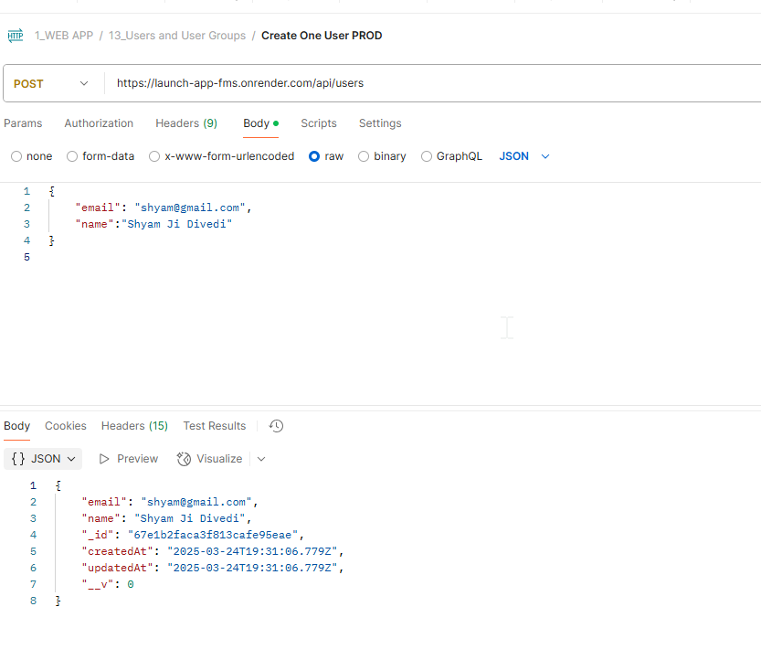

# 1. How to deploy the backend to node backend

For time being since we dont have get / defined so it will throw as below -

Now get the latest commit and deploy it ..

and now its running the app get on live render

also we should verify first on local server if running before deploying to render..

now we have two environments
one tied to dev and another tied to main.

With this process we are able to complete the deployment on render.

# 2. We are ready with the backend changes and the api is made as per point in 006 and line number 466.

Now we will deploy it to dev server first to perform the testing if working or not .

- git status

- git add .
- git branch -m dev
- git commit -m "Change set: users and user groups push"
- git push -u origin dev

# 3. setting up render to understand environment variables and mongo db related setups

its finally failing to deploy as mongod db connection is not happening and we need to change the strategy
the following is the error .

and now change the dev environment variable settings .
with the db name = fms-cloud-live-dev-db

After clearing the build cache and rerun the build again it worked ..

and now the backend is working .
Now we will do some testing in dev server with postman and if everything works then we will deploy the code to prod or main branch

- it worked fine
  

# 6. Doing the deployment for prod server

and for production or the main branch the db name = fms-cloud-live-prod-db

- lets do the environment setup for this as well .

with this the deployment to prod and dev server is done on render .
we can do one round of testing in prod as well.

