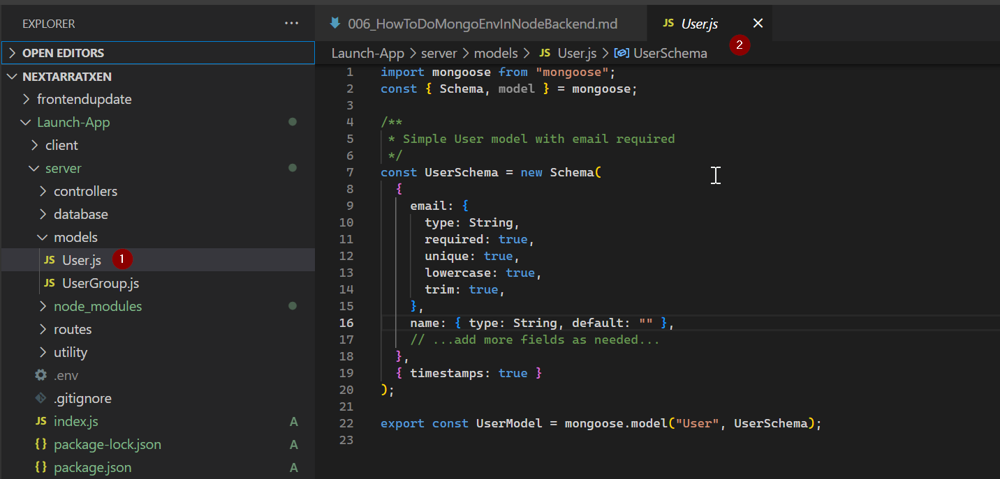
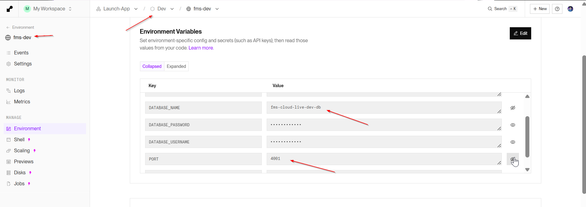
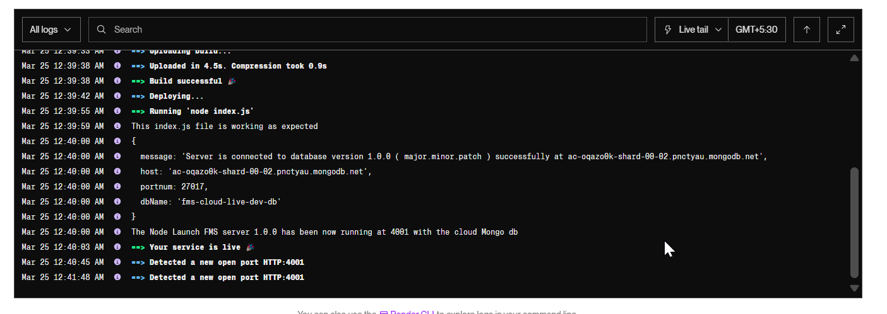
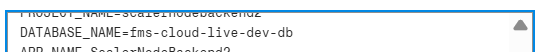
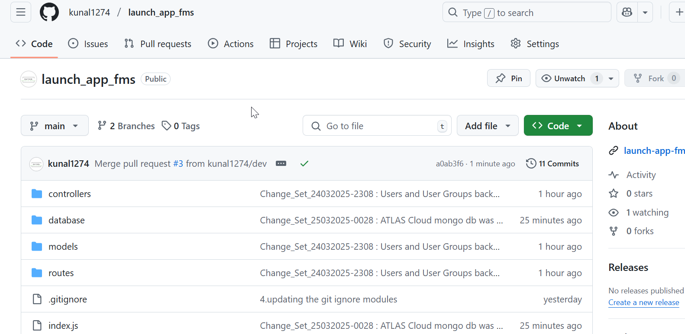
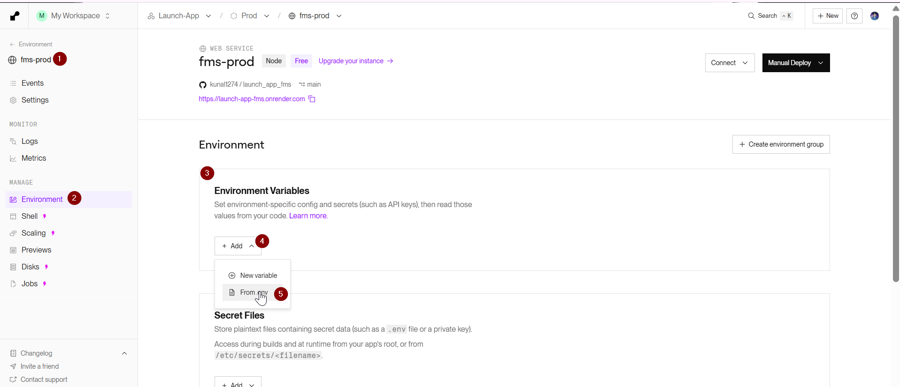
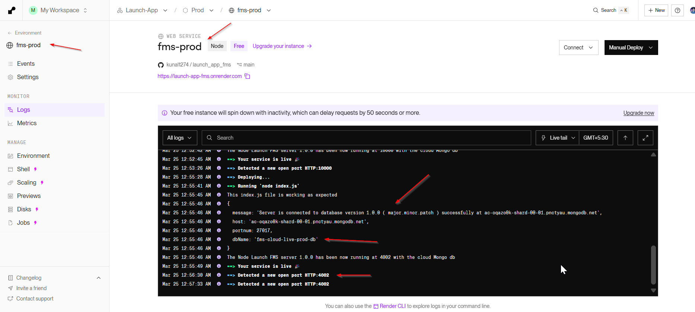
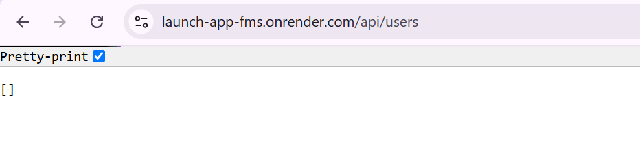

# 1. How to install mongoose express cors and dotenv

```bash
npm install mongoose cors dotenv
```


- Create the folders like controllers models routes utility and database for future use . Also create one .env file as welll
  install the nodemon as dev dependencies
  package.json file will change after

```json
{
  "name": "server",
  "version": "1.0.0",
  "description": "server for fms backend",
  "license": "ISC",
  "author": "Ratxen Solutions Private Limited",
  "type": "module",
  "main": "index.js",
  "keywords": [],
  "scripts": {
    "test": "echo \"Error: no test specified\" && exit 1",
    "start": "node index.js"
  },
  "dependencies": {
    "cors": "^2.8.5", // new
    "dotenv": "^16.4.7", // new
    "express": "^4.21.2",
    "mongoose": "^8.12.2" // new
  },
  "devDependencies": {
    // new
    "nodemon": "^3.1.9" // new
  } // new
}
```


Create a .env file and you can set the local mongodb ( You can install the mongo db locally by using the following website
)

- [install mongodb on windows](https://www.mongodb.com/docs/manual/tutorial/install-mongodb-on-windows/)
  [Install mongodb on any system depending upon ur selection ](https://www.mongodb.com/try/download/community)

```.env
PORT=4000
MONGO_URI=mongodb://localhost:27017/fmsdevdb
```

# 2. Lets create the folders for models controllers routes and utility .. modify the index. js as per need .


- Add the models for users and usergroups

//server/models/User.js

```javascript
import mongoose from "mongoose";
const { Schema, model } = mongoose;

/**
 * Simple User model with email required
 */
const UserSchema = new Schema(
  {
    email: {
      type: String,
      required: true,
      unique: true,
      lowercase: true,
      trim: true,
    },
    name: { type: String, default: "" },
    // ...add more fields as needed...
  },
  { timestamps: true }
);

export const UserModel = mongoose.model("User", UserSchema);
```



and the
//server/models/UserGroup.js

```javascript
import mongoose from "mongoose";
const { Schema, model } = mongoose;

/**
 * A simple group model referencing user owners/members
 */
const UserGroupSchema = new Schema({
  name: { type: String, required: true, trim: true },
  owner: { type: Schema.Types.ObjectId, ref: "User", default: null },
  secondOwner: { type: Schema.Types.ObjectId, ref: "User", default: null },
  thirdOwner: { type: Schema.Types.ObjectId, ref: "User", default: null },
  members: [{ type: Schema.Types.ObjectId, ref: "User" }],
});

export const UserGroupModel = mongoose.model("UserGroup", UserGroupSchema);
```


- Now lets move to the controllers
  

Content of the files are ::
//server/controllers/userRoutes.js

```javascript
import { UserModel } from "../models/User.js";

/**
 * Create a new user
 */
export const createUser = async (req, res) => {
  try {
    const { email, name } = req.body;
    const newUser = new UserModel({ email, name });
    const savedUser = await newUser.save();
    return res.status(201).json(savedUser);
  } catch (error) {
    console.error("Error creating user:", error);
    return res.status(500).json({ error: "Internal server error" });
  }
};

/**
 * Get all users
 */
export const getUsers = async (req, res) => {
  try {
    const users = await UserModel.find();
    return res.json(users);
  } catch (error) {
    console.error("Error fetching users:", error);
    return res.status(500).json({ error: "Internal server error" });
  }
};

/**
 * Get a single user by ID
 */
export const getUserById = async (req, res) => {
  try {
    const { userId } = req.params;
    const user = await UserModel.findById(userId);
    if (!user) {
      return res.status(404).json({ error: "User not found" });
    }
    return res.json(user);
  } catch (error) {
    console.error("Error fetching user:", error);
    return res.status(500).json({ error: "Internal server error" });
  }
};

/**
 * Update a user by ID
 */
export const updateUser = async (req, res) => {
  try {
    const { userId } = req.params;
    const { email, name } = req.body;

    const updatedUser = await UserModel.findByIdAndUpdate(
      userId,
      { email, name },
      { new: true } // returns the updated document
    );
    if (!updatedUser) {
      return res.status(404).json({ error: "User not found" });
    }
    return res.json(updatedUser);
  } catch (error) {
    console.error("Error updating user:", error);
    return res.status(500).json({ error: "Internal server error" });
  }
};

/**
 * Delete a user by ID
 */
export const deleteUser = async (req, res) => {
  try {
    const { userId } = req.params;
    const deletedUser = await UserModel.findByIdAndDelete(userId);
    if (!deletedUser) {
      return res.status(404).json({ error: "User not found" });
    }
    return res.json({ message: "User deleted successfully" });
  } catch (error) {
    console.error("Error deleting user:", error);
    return res.status(500).json({ error: "Internal server error" });
  }
};
```

//server/controllers/userGroupRoutes.js

```javascript
import { UserGroupModel } from "../models/UserGroup.js";
/**
 * Create a new user group
 */
export const createUserGroup = async (req, res) => {
  try {
    const { name, owner, secondOwner, thirdOwner, members } = req.body;

    const userGroup = new UserGroupModel({
      name,
      owner,
      secondOwner,
      thirdOwner,
      members,
    });

    const savedGroup = await userGroup.save();
    return res.status(201).json(savedGroup);
  } catch (error) {
    console.error("Error creating user group:", error);
    return res.status(500).json({ error: "Internal server error" });
  }
};

/**
 * Get all user groups
 */
export const getUserGroups = async (req, res) => {
  try {
    // Optionally, populate owners/members to return the user documents
    const userGroups = await UserGroupModel.find()
      .populate("owner")
      .populate("secondOwner")
      .populate("thirdOwner")
      .populate("members");

    return res.json(userGroups);
  } catch (error) {
    console.error("Error fetching user groups:", error);
    return res.status(500).json({ error: "Internal server error" });
  }
};

/**
 * Get a single user group by ID
 */
export const getUserGroupById = async (req, res) => {
  try {
    const { groupId } = req.params;

    const userGroup = await UserGroupModel.findById(groupId)
      .populate("owner")
      .populate("secondOwner")
      .populate("thirdOwner")
      .populate("members");

    if (!userGroup) {
      return res.status(404).json({ error: "User group not found" });
    }

    return res.json(userGroup);
  } catch (error) {
    console.error("Error fetching user group:", error);
    return res.status(500).json({ error: "Internal server error" });
  }
};

/**
 * Update a user group by ID
 */
export const updateUserGroup = async (req, res) => {
  try {
    const { groupId } = req.params;
    const { name, owner, secondOwner, thirdOwner, members } = req.body;

    const updatedGroup = await UserGroupModel.findByIdAndUpdate(
      groupId,
      { name, owner, secondOwner, thirdOwner, members },
      { new: true }
    )
      .populate("owner")
      .populate("secondOwner")
      .populate("thirdOwner")
      .populate("members");

    if (!updatedGroup) {
      return res.status(404).json({ error: "User group not found" });
    }

    return res.json(updatedGroup);
  } catch (error) {
    console.error("Error updating user group:", error);
    return res.status(500).json({ error: "Internal server error" });
  }
};

/**
 * Delete a user group by ID
 */
export const deleteUserGroup = async (req, res) => {
  try {
    const { groupId } = req.params;
    const deletedGroup = await UserGroupModel.findByIdAndDelete(groupId);

    if (!deletedGroup) {
      return res.status(404).json({ error: "User group not found" });
    }

    return res.json({ message: "User group deleted successfully" });
  } catch (error) {
    console.error("Error deleting user group:", error);
    return res.status(500).json({ error: "Internal server error" });
  }
};
```

- Now lets do the routes


Contents of the file are ::

//server/routes/userRoutes.js

```javascript
import { Router } from "express";
const userRouter = Router();

import {
  getUsers,
  getUserById,
  updateUser,
  deleteUser,
  createUser,
} from "../controllers/userController.js";

// CREATE
userRouter.post("/", createUser);

// READ ALL
userRouter.get("/", getUsers);

// READ ONE
userRouter.get("/:userId", getUserById);

// UPDATE
userRouter.put("/:userId", updateUser);

// DELETE
userRouter.delete("/:userId", deleteUser);

export default userRouter;
```

//server/routes/userGroupRoutes.js

```javascript
import { Router } from "express";
const userGroupRouter = Router();

import {
  createUserGroup,
  getUserGroups,
  getUserGroupById,
  updateUserGroup,
  deleteUserGroup,
} from "../controllers/userGroupController.js";

// CREATE
userGroupRouter.post("/", createUserGroup);

// READ ALL
userGroupRouter.get("/", getUserGroups);

// READ ONE
userGroupRouter.get("/:groupId", getUserGroupById);

// UPDATE
userGroupRouter.put("/:groupId", updateUserGroup);

// DELETE
userGroupRouter.delete("/:groupId", deleteUserGroup);

export default userGroupRouter;
```

- Now lets finally modify the index.js


```javascript
import dotenv from "dotenv";
dotenv.config(); // Loads .env into process.env

// In-built Node JS Modules Import
import expressAumMrigah from "express";

// 3rd-Party Node JS Modules Import
import mongoose from "mongoose";
import cors from "cors";

// Project FMS server related imports
import userGroupRouter from "./routes/userGroupRoutes.js";
import userRouter from "./routes/userRoutes.js";

// Environment variables
const PORT = process.env.PORT || 3000;
const MONGO_URI = process.env.MONGO_URI;

console.log("This index.js file is working as expected");
const AumMrigahApp = expressAumMrigah();

// Middleware
AumMrigahApp.use(expressAumMrigah.json());
AumMrigahApp.use(cors());

// new2-start
// Connect to MongoDB
mongoose
  .connect(MONGO_URI, {
    // NOTE: If you're on Mongoose 6+, you do not necessarily need these:
    // useNewUrlParser: true,
    // useUnifiedTopology: true,
  })
  .then(() => {
    console.log("MongoDB connected!");
  })
  .catch((err) => {
    console.error("MongoDB connection error:", err);
  });

// Routes
AumMrigahApp.use("/api/users", userRouter);
AumMrigahApp.use("/api/userGroups", userGroupRouter);
//new2-end

AumMrigahApp.get("/", (req, res) => {
  res.send(`Hello from Express on Render at Port number ${PORT}!`);
});

AumMrigahApp.listen(PORT, () => {
  console.log(`The Node fms-server.1.0.0 is running at port ${PORT}`);
});
```

The following are the changes till now ..


# 3. Perform all the testing with the postman whether working fine or not

[Link to Postman Testing](https://go.postman.co/workspace/FMS-API-Team-Workspace~d6b263b9-a1f7-4e30-b85f-908505de1774/documentation/29048340-722b4ca9-5f81-4c92-b97f-0467192259d4?entity=folder-779c88b9-fe6c-4fa2-b819-42819fe2f272)

# 4. Now pushing to the Render with all the changes

Refer the docs 005.How to Deploy Backend On Render
since the deployment is failing on render as its looking for cloud atlas kind of uri which we will perform first in local as well.

# 5. Creating the database connection first

//server/database/mongoDb.js

```javascript
import mongoose from "mongoose";

const connectToDb = async () => {
  const uriWithEnv = `mongodb+srv://${process.env.DATABASE_USERNAME}:${process.env.DATABASE_PASSWORD}@${process.env.PROJECT_NAME}.pnctyau.mongodb.net/${process.env.DATABASE_NAME}?retryWrites=true&w=majority&appName=${process.env.APP_NAME}`;
  try {
    const options = {
      //useNewUrlParser: true,
      //useUnifiedTopology: true, // Ensures Mongoose uses the new connection engine
      serverSelectionTimeoutMS: 5000, // Reduces connection timeout for faster error reporting
      socketTimeoutMS: 45000, // Keeps the connection alive for up to 45 seconds
      sanitizeFilter: true, // to do the filter on query
    };

    const { connection } = await mongoose.connect(uriWithEnv, options);
    if (connection) {
      console.log({
        message: `Server is connected to database version 1.0.0 ( major.minor.patch ) successfully at ${connection.host}`,
        host: connection.host,
        portnum: connection.port,
        dbName: connection.name,
      });
    }
  } catch (error) {
    console.error({
      message: `The error has been caught while connecting to the mongo db : ${error}`,
      error,
    });
  }
};

export default connectToDb;
```


- now modifying index.js file from the last

```javascript
import dotenv from "dotenv";
dotenv.config(); // Loads .env into process.env

// In-built Node JS Modules Import
import expressAumMrigah from "express";

// 3rd-Party Node JS Modules Import
import mongoose from "mongoose"; // new2
import cors from "cors"; // new2

// Project FMS server related imports
import userGroupRouter from "./routes/userGroupRoutes.js";
import userRouter from "./routes/userRoutes.js";
import connectToDb from "./database/mongoDb.js";

// Environment variables
const PORT = process.env.PORT || 3000;
const MONGO_URI = process.env.MONGO_URI;

console.log("This index.js file is working as expected");
const AumMrigahApp = expressAumMrigah();

// Middleware
AumMrigahApp.use(expressAumMrigah.json());
AumMrigahApp.use(cors());

// new2-start
// Connect to MongoDB
// mongoose
//   .connect(MONGO_URI, {
//     // NOTE: If you're on Mongoose 6+, you do not necessarily need these:
//     // useNewUrlParser: true,
//     // useUnifiedTopology: true,
//   })
//   .then(() => {
//     console.log("MongoDB connected!");
//   })
//   .catch((err) => {
//     console.error("MongoDB connection error:", err);
//   });

// Routes

AumMrigahApp.use("/api/users", userRouter);
AumMrigahApp.use("/api/userGroups", userGroupRouter);
//new2-end

AumMrigahApp.get("/", (req, res) => {
  res.send(`Hello from Express on Render at Port number ${PORT}!`);
});

// AumMrigahApp.listen(PORT, () => {
//   console.log(`The Node fms-server.1.0.0 is running at port ${PORT}`);
// });

const startServer = async () => {
  try {
    await connectToDb();
    AumMrigahApp.listen(PORT, () => {
      console.log(
        `The Node Launch FMS server 1.0.0 has been now running at ${PORT} with the cloud Mongo db`
      );
    });
  } catch (error) {
    console.error(`Server is unable to start due to some error : ${error}`);
    process.exit(1);
  }
};

startServer();
```


- test with local postman and if it works then ready for redeploy with new environment variable connection
  bettter local dev db give a name with local prefix
  and live dev db provide the name with live prefix
  for local


- first lets push the code to dev branch
  
  

and now change the dev environment variable settings .
with the db name = fms-cloud-live-dev-db



After clearing the build cache and rerun the build again it worked ..




and now the backend is working .
Now we will do some testing in dev server with postman and if everything works then we will deploy the code to prod or main branch

- it worked fine
  

# 6. Doing the deployment for prod server

and for production or the main branch the db name = fms-cloud-live-prod-db




- lets do the environment setup for this as well .







with this the deployment to prod and dev server is done on render .
we can do one round of testing in prod as well.





