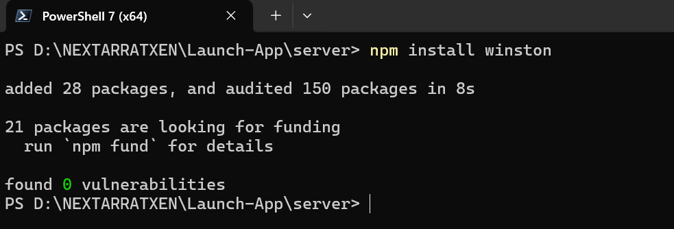
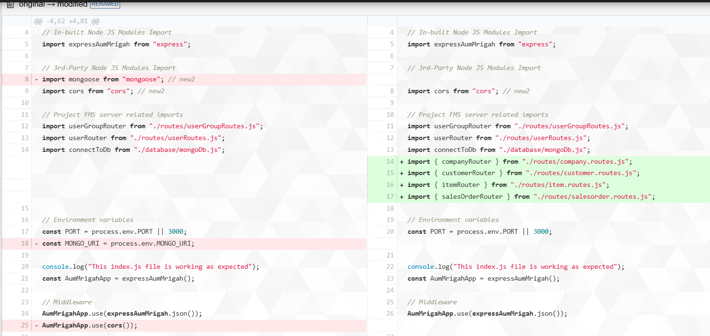
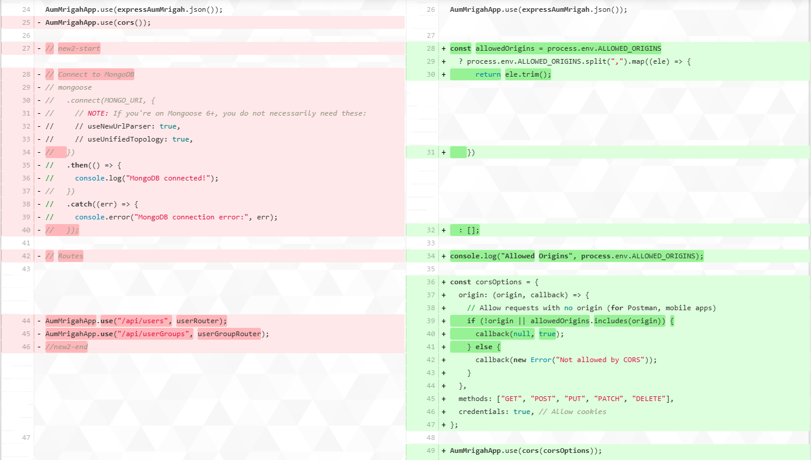
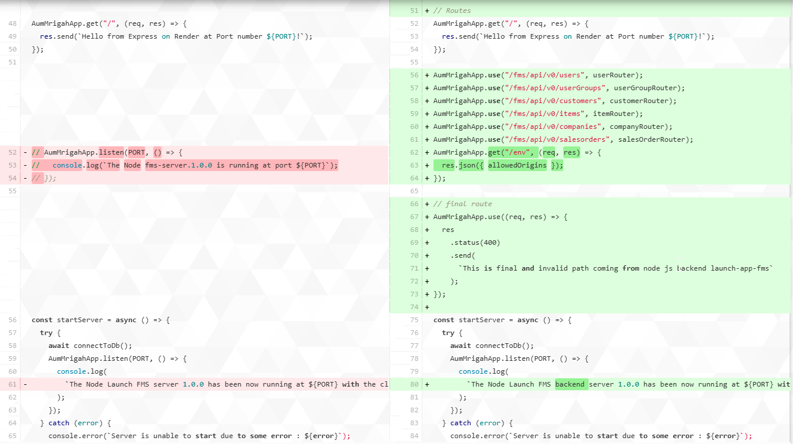
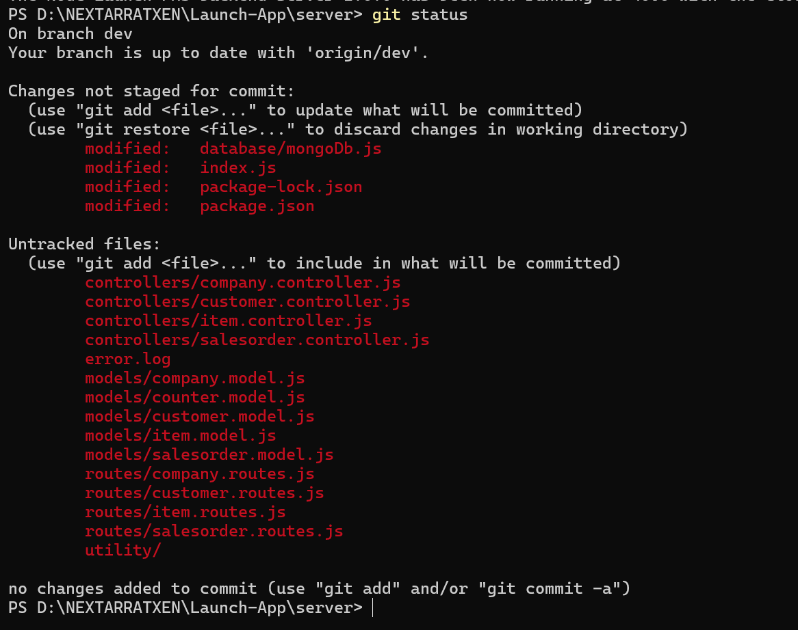
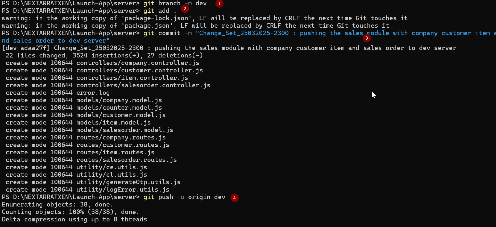
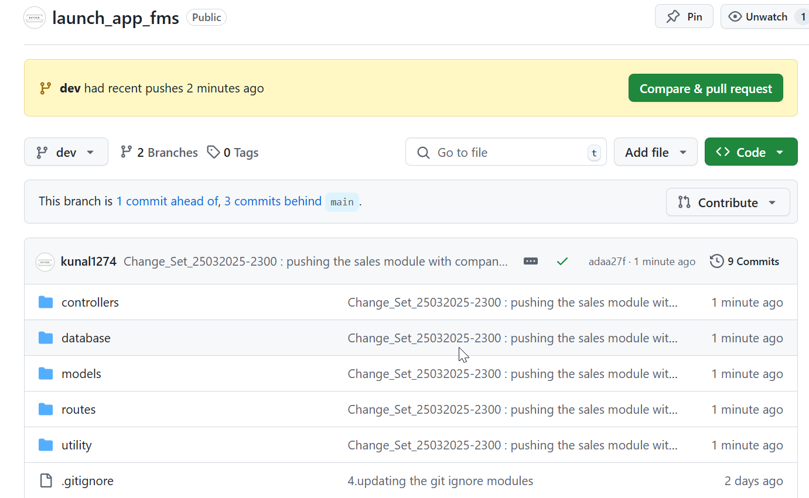
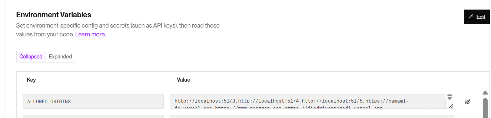
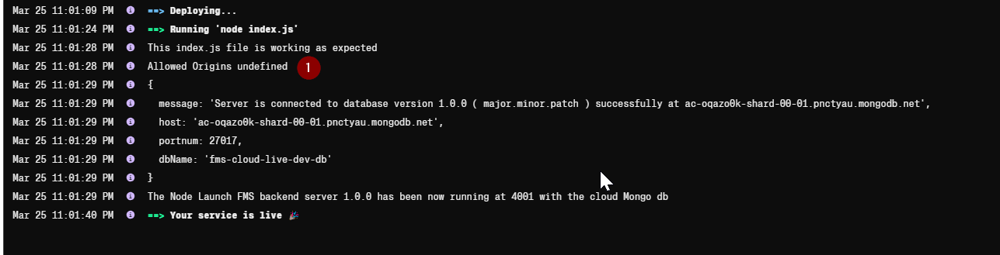
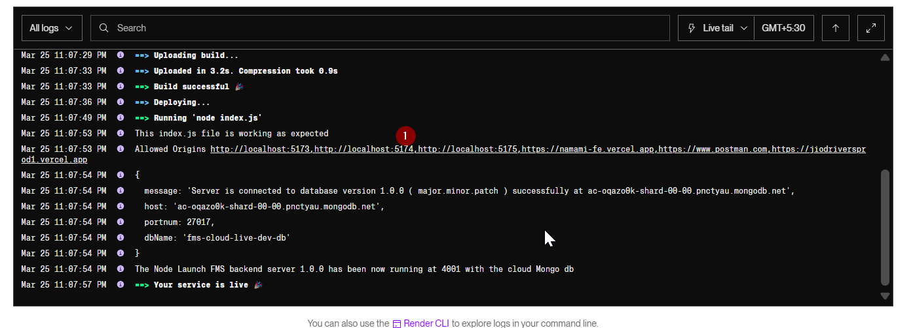

# 1. Working on the Sales module

- installing some of the important packages to be used for making the Sales module.
  winston package

  ```bash
  npm install winston
  ```

  

- Company Models
- - Create the Models

```javascript
import mongoose, { Schema, model } from "mongoose";

/**
 * Subschema for Bank Account Details.
 * This schema holds information for one bank account.
 */
const BankDetailsSchema = new Schema(
  {
    accountNumber: {
      type: String,
      required: true,
      trim: true,
    },
    bankName: {
      type: String,
      required: true,
      trim: true,
    },
    bankAddress: {
      type: String,
      required: false,
      trim: true,
    },
    ifscCode: {
      type: String,
      required: true,
      trim: true,
    },
    swiftCode: {
      type: String,
      required: false,
      trim: true,
    },
    upiDetails: {
      type: String,
      required: false,
      trim: true,
    },
    qrDetails: {
      type: String,
      required: false,
      trim: true,
    },
  },
  { _id: false }
); // _id false to prevent a separate id for each subdocument

/**
 * Subschema for Tax Information.
 */
const TaxInfoSchema = new Schema(
  {
    gstNumber: {
      type: String,
      required: false,
      trim: true,
    },
    tanNumber: {
      type: String,
      required: false,
      trim: true,
    },
    panNumber: {
      type: String,
      required: false,
      trim: true,
    },
  },
  { _id: false }
);

/**
 * Main Company Schema.
 */
const CompanySchema = new Schema(
  {
    companyCode: {
      type: String,
      required: true,
      unique: true,
      trim: true,
      // You can enforce uppercase if needed by using a pre-save hook.
    },
    companyName: {
      type: String,
      required: true,
      trim: true,
    },
    primaryGSTAddress: {
      type: String,
      required: true,
      trim: true,
    },
    secondaryOfficeAddress: {
      type: String,
      required: false,
      trim: true,
    },
    tertiaryShippingAddress: {
      type: String,
      required: false,
      trim: true,
    },
    logoImage: {
      type: String,
      required: false,
      trim: true,
      // Typically a URL pointing to the company logo image.
    },
    email: {
      type: String,
      required: true,
      unique: true,
      trim: true,
      lowercase: true,
    },
    contactNumber: {
      type: String,
      required: false,
      trim: true,
    },
    website: {
      type: String,
      required: false,
      trim: true,
    },
    bankDetails: [BankDetailsSchema], // Array of bank account details.
    taxInfo: TaxInfoSchema, // Tax information subdocument.
    // Additional fields if needed (like active flag, created/updated timestamps) can be added:
    archived: { type: Boolean, default: false }, // New field
    createdBy: {
      type: String,
      required: true,
      default: "SystemCompanyCreation",
    },
    updatedBy: {
      type: String,
      default: null,
    },
    active: {
      type: Boolean,
      default: true,
    },
  },
  {
    timestamps: true,
    toJSON: {
      virtuals: true,
      transform: function (doc, ret) {
        // Remove __v if you wish
        //delete ret.__v;
        // Sort keys alphabetically for easier reading
        const sorted = {};
        Object.keys(ret)
          .sort()
          .forEach((key) => {
            sorted[key] = ret[key];
          });
        return sorted;
      },
    },
    toObject: { virtuals: true },
  }
);

/**
 * Pre-save hook to normalize and validate fields.
 * For example, we ensure that email is lowercase and trim companyCode.
 */
CompanySchema.pre("save", function (next) {
  // Ensure email is lowercase (this is already done by the schema 'lowercase' option)
  if (this.email) {
    this.email = this.email.toLowerCase().trim();
  }
  // Trim companyCode and companyName, etc.
  if (this.companyCode) {
    this.companyCode = this.companyCode.trim();
    this.companyCode = this.companyCode.toUpperCase();
  }
  if (this.companyName) {
    this.companyName = this.companyName.trim();
  }
  // Optionally, force companyCode to uppercase:
  // this.companyCode = this.companyCode.toUpperCase();

  next();
});

/**
 * Pre-find hook to automatically filter out inactive companies (if desired).
 * Uncomment the following if you want every find query to include active: true.
 */
// CompanySchema.pre(/^find/, function (next) {
//   this.where({ active: true });
//   next();
// });

/**
 * Indexing:
 * - Unique index on companyCode and email.
 */
// CompanySchema.index({ companyCode: 1 });
// CompanySchema.index({ email: 1 });

export const CompanyModel =
  mongoose.models.Company || model("Company", CompanySchema);
```

- - Create the Controllers

```javascript
// controllers/1_0_0/company.controller.js

//import { CompanyModel } from "../../models/1_0_0/company.1_0_0.model.js";
import { CompanyModel } from "../models/company.model.js";
import { winstonLogger, logError } from "../utility/logError.utils.js";

/**
 * Create a new Company.
 * Required fields: companyCode, companyName, primaryGSTAddress, and email.
 */
export const createCompany = async (req, res) => {
  try {
    const companyData = req.body;

    // Validate required fields
    if (
      !companyData.companyCode ||
      !companyData.companyName ||
      !companyData.primaryGSTAddress ||
      !companyData.email
    ) {
      return res.status(422).json({
        status: "failure",
        message:
          "Company code, company name, primary GST address, and email are required.",
      });
    }

    // Create the company document
    const company = await CompanyModel.create(companyData);
    winstonLogger.info(`Company created successfully: ${company._id}`);
    return res.status(201).json({
      status: "success",
      message: "Company created successfully.",
      data: company,
    });
  } catch (error) {
    logError("Company Creation", error);
    if (error.name === "ValidationError") {
      return res.status(422).json({
        status: "failure",
        message: "Validation error during company creation.",
        error: error.message,
      });
    }
    return res.status(500).json({
      status: "failure",
      message: "Internal Server Error",
      error: error.message,
    });
  }
};

/**
 * Retrieve all Companies.
 */
export const getAllCompanies = async (req, res) => {
  try {
    const companies = await CompanyModel.find();
    winstonLogger.info(`Retrieved ${companies.length} companies.`);
    return res.status(200).json({
      status: "success",
      message: "Companies retrieved successfully.",
      count: companies.length,
      data: companies,
    });
  } catch (error) {
    logError("Get All Companies", error);
    return res.status(500).json({
      status: "failure",
      message: "Internal Server Error",
      error: error.message,
    });
  }
};

/**
 * Retrieve a Company by ID.
 */
export const getCompanyById = async (req, res) => {
  try {
    const { companyId } = req.params;
    const company = await CompanyModel.findById(companyId);
    if (!company) {
      return res.status(404).json({
        status: "failure",
        message: "Company not found.",
      });
    }
    winstonLogger.info(`Retrieved company: ${company._id}`);
    return res.status(200).json({
      status: "success",
      message: "Company retrieved successfully.",
      data: company,
    });
  } catch (error) {
    logError("Get Company By ID", error);
    return res.status(500).json({
      status: "failure",
      message: "Internal Server Error",
      error: error.message,
    });
  }
};

/**
 * Update a Company by ID.
 */
export const updateCompanyById = async (req, res) => {
  try {
    const { companyId } = req.params;
    const updateData = req.body;
    // Update the updatedBy field (assuming req.user is populated via authentication middleware)
    updateData.updatedBy = req.user?.username || "Unknown";
    const company = await CompanyModel.findByIdAndUpdate(
      companyId,
      updateData,
      {
        new: true,
        runValidators: true,
      }
    );
    if (!company) {
      return res.status(404).json({
        status: "failure",
        message: "Company not found.",
      });
    }
    winstonLogger.info(`Updated company: ${company._id}`);
    return res.status(200).json({
      status: "success",
      message: "Company updated successfully.",
      data: company,
    });
  } catch (error) {
    logError("Update Company By ID", error);
    if (error.name === "ValidationError") {
      return res.status(422).json({
        status: "failure",
        message: "Validation error during company update.",
        error: error.message,
      });
    }
    return res.status(500).json({
      status: "failure",
      message: "Internal Server Error",
      error: error.message,
    });
  }
};

/**
 * Delete a Company by ID.
 */
export const deleteCompanyById = async (req, res) => {
  try {
    const { companyId } = req.params;
    const company = await CompanyModel.findByIdAndDelete(companyId);
    if (!company) {
      return res.status(404).json({
        status: "failure",
        message: "Company not found.",
      });
    }
    winstonLogger.info(`Deleted company: ${company._id}`);
    return res.status(200).json({
      status: "success",
      message: "Company deleted successfully.",
    });
  } catch (error) {
    logError("Delete Company By ID", error);
    return res.status(500).json({
      status: "failure",
      message: "Internal Server Error",
      error: error.message,
    });
  }
};

/**
 * Archive a Company by ID.
 * This sets the "archived" field to true.
 */
export const archiveCompanyById = async (req, res) => {
  try {
    const { companyId } = req.params;
    const updateData = {
      archived: true,
      updatedBy: req.user?.username || "Unknown",
    };
    const company = await CompanyModel.findByIdAndUpdate(
      companyId,
      updateData,
      { new: true }
    );
    if (!company) {
      return res.status(404).json({
        status: "failure",
        message: "Company not found.",
      });
    }
    winstonLogger.info(`Archived company: ${company._id}`);
    return res.status(200).json({
      status: "success",
      message: "Company archived successfully.",
      data: company,
    });
  } catch (error) {
    logError("Archive Company", error);
    return res.status(500).json({
      status: "failure",
      message: "Internal Server Error",
      error: error.message,
    });
  }
};

/**
 * Unarchive a Company by ID.
 * This sets the "archived" field to false.
 */
export const unarchiveCompanyById = async (req, res) => {
  try {
    const { companyId } = req.params;
    const updateData = {
      archived: false,
      updatedBy: req.user?.username || "Unknown",
    };
    const company = await CompanyModel.findByIdAndUpdate(
      companyId,
      updateData,
      { new: true }
    );
    if (!company) {
      return res.status(404).json({
        status: "failure",
        message: "Company not found.",
      });
    }
    winstonLogger.info(`Unarchived company: ${company._id}`);
    return res.status(200).json({
      status: "success",
      message: "Company unarchived successfully.",
      data: company,
    });
  } catch (error) {
    logError("Unarchive Company", error);
    return res.status(500).json({
      status: "failure",
      message: "Internal Server Error",
      error: error.message,
    });
  }
};

/**
 * Retrieve archived Companies.
 */
export const getArchivedCompanies = async (req, res) => {
  try {
    const companies = await CompanyModel.find({ archived: true });
    winstonLogger.info(`Retrieved ${companies.length} archived companies.`);
    return res.status(200).json({
      status: "success",
      message: "Archived companies retrieved successfully.",
      data: companies,
    });
  } catch (error) {
    logError("Get Archived Companies", error);
    return res.status(500).json({
      status: "failure",
      message: "Internal Server Error",
      error: error.message,
    });
  }
};
```

- - Create the routes

```javascript
// routes/1_0_0/company.routes.js

import express from "express";
import {
  createCompany,
  getAllCompanies,
  getCompanyById,
  updateCompanyById,
  deleteCompanyById,
  archiveCompanyById,
  unarchiveCompanyById,
  getArchivedCompanies,
} from "../controllers/company.controller.js";

const companyRouter = express.Router();

companyRouter.post("/", createCompany);
companyRouter.get("/archived", getArchivedCompanies); // Must be defined before :companyId route
companyRouter.get("/", getAllCompanies);
companyRouter.get("/:companyId", getCompanyById);
companyRouter.put("/:companyId", updateCompanyById);
companyRouter.delete("/:companyId", deleteCompanyById);
companyRouter.patch("/:companyId/archive", archiveCompanyById);
companyRouter.patch("/:companyId/unarchive", unarchiveCompanyById);

export { companyRouter };
```

- - calling the routers in the index or main server entry file

```javascript
import dotenv from "dotenv";
dotenv.config(); // Loads .env into process.env

// In-built Node JS Modules Import
import expressAumMrigah from "express";

// 3rd-Party Node JS Modules Import
import cors from "cors"; // new2

// Project FMS server related imports
import userGroupRouter from "./routes/userGroupRoutes.js";
import userRouter from "./routes/userRoutes.js";
import connectToDb from "./database/mongoDb.js";
import { companyRouter } from "./routes/company.routes.js"; // ADDED HERE
import { customerRouter } from "./routes/customer.routes.js";
import { itemRouter } from "./routes/item.routes.js";
import { salesOrderRouter } from "./routes/salesorder.routes.js";
import { vendorRouter } from "./routes/vendor.routes.js";
import { purchaseOrderRouter } from "./routes/purchaseorder.routes.js";

// Environment variables
const PORT = process.env.PORT || 3000;

console.log("This index.js file is working as expected");
const AumMrigahApp = expressAumMrigah();

// Middleware
AumMrigahApp.use(expressAumMrigah.json());

const allowedOrigins = process.env.ALLOWED_ORIGINS
  ? process.env.ALLOWED_ORIGINS.split(",").map((ele) => {
      return ele.trim();
    })
  : [];

console.log("Allowed Origins", process.env.ALLOWED_ORIGINS);

const corsOptions = {
  origin: (origin, callback) => {
    // Allow requests with no origin (for Postman, mobile apps)
    if (!origin || allowedOrigins.includes(origin)) {
      callback(null, true);
    } else {
      callback(new Error("Not allowed by CORS"));
    }
  },
  methods: ["GET", "POST", "PUT", "PATCH", "DELETE"],
  credentials: true, // Allow cookies
};

AumMrigahApp.use(cors(corsOptions));

// Routes
AumMrigahApp.get("/", (req, res) => {
  res.send(`Hello from Express on Render at Port number ${PORT}!`);
});

AumMrigahApp.use("/fms/api/v0/users", userRouter);
AumMrigahApp.use("/fms/api/v0/userGroups", userGroupRouter);
AumMrigahApp.use("/fms/api/v0/customers", customerRouter);
AumMrigahApp.use("/fms/api/v0/vendors", vendorRouter);
AumMrigahApp.use("/fms/api/v0/items", itemRouter);
AumMrigahApp.use("/fms/api/v0/companies", companyRouter); // ADDED HERE
AumMrigahApp.use("/fms/api/v0/salesorders", salesOrderRouter);
AumMrigahApp.use("/fms/api/v0/purchaseorders", purchaseOrderRouter);

AumMrigahApp.get("/env", (req, res) => {
  res.json({ allowedOrigins });
});

// final route
AumMrigahApp.use((req, res) => {
  res
    .status(400)
    .send(
      `This is final and invalid path coming from node js backend launch-app-fms`
    );
});

const startServer = async () => {
  try {
    await connectToDb();
    AumMrigahApp.listen(PORT, () => {
      console.log(
        `The Node Launch FMS backend server 1.0.0 has been now running at ${PORT} with the cloud Mongo db`
      );
    });
  } catch (error) {
    console.error(`Server is unable to start due to some error : ${error}`);
    process.exit(1);
  }
};

startServer();
```

- Counter models
- - Create the Models
- - Create the Controllers
- - Create the routes
- - calling the routers in the index or main server entry file

- Customer models
- - Create the Models
- - Create the Controllers
- - Create the routes
- - calling the routers in the index or main server entry file

- Item Models
- - Create the Models
- - Create the Controllers
- - Create the routes
- - calling the routers in the index or main server entry file

- Sales order Models
- - Create the Models
- - Create the Controllers
- - Create the routes
- - calling the routers in the index or main server entry file

- index.js changes

Old index.js

```javascript
import dotenv from "dotenv";
dotenv.config(); // Loads .env into process.env

// In-built Node JS Modules Import
import expressAumMrigah from "express";

// 3rd-Party Node JS Modules Import
import mongoose from "mongoose"; // new2
import cors from "cors"; // new2

// Project FMS server related imports
import userGroupRouter from "./routes/userGroupRoutes.js";
import userRouter from "./routes/userRoutes.js";
import connectToDb from "./database/mongoDb.js";

// Environment variables
const PORT = process.env.PORT || 3000;
const MONGO_URI = process.env.MONGO_URI;

console.log("This index.js file is working as expected");
const AumMrigahApp = expressAumMrigah();

// Middleware
AumMrigahApp.use(expressAumMrigah.json());
AumMrigahApp.use(cors());

// Routes

AumMrigahApp.use("/api/users", userRouter);
AumMrigahApp.use("/api/userGroups", userGroupRouter);
//new2-end

AumMrigahApp.get("/", (req, res) => {
  res.send(`Hello from Express on Render at Port number ${PORT}!`);
});

const startServer = async () => {
  try {
    await connectToDb();
    AumMrigahApp.listen(PORT, () => {
      console.log(
        `The Node Launch FMS server 1.0.0 has been now running at ${PORT} with the cloud Mongo db`
      );
    });
  } catch (error) {
    console.error(`Server is unable to start due to some error : ${error}`);
    process.exit(1);
  }
};

startServer();
```

and New index.js

```javascript
import dotenv from "dotenv";
dotenv.config(); // Loads .env into process.env

// In-built Node JS Modules Import
import expressAumMrigah from "express";

// 3rd-Party Node JS Modules Import
import cors from "cors"; // new2

// Project FMS server related imports
import userGroupRouter from "./routes/userGroupRoutes.js";
import userRouter from "./routes/userRoutes.js";
import connectToDb from "./database/mongoDb.js";
import { companyRouter } from "./routes/company.routes.js";
import { customerRouter } from "./routes/customer.routes.js";
import { itemRouter } from "./routes/item.routes.js";
import { salesOrderRouter } from "./routes/salesorder.routes.js";

// Environment variables
const PORT = process.env.PORT || 3000;

console.log("This index.js file is working as expected");
const AumMrigahApp = expressAumMrigah();

// Middleware
AumMrigahApp.use(expressAumMrigah.json());

const allowedOrigins = process.env.ALLOWED_ORIGINS
  ? process.env.ALLOWED_ORIGINS.split(",").map((ele) => {
      return ele.trim();
    })
  : [];

console.log("Allowed Origins", process.env.ALLOWED_ORIGINS);

const corsOptions = {
  origin: (origin, callback) => {
    // Allow requests with no origin (for Postman, mobile apps)
    if (!origin || allowedOrigins.includes(origin)) {
      callback(null, true);
    } else {
      callback(new Error("Not allowed by CORS"));
    }
  },
  methods: ["GET", "POST", "PUT", "PATCH", "DELETE"],
  credentials: true, // Allow cookies
};

AumMrigahApp.use(cors(corsOptions));

// Routes
AumMrigahApp.get("/", (req, res) => {
  res.send(`Hello from Express on Render at Port number ${PORT}!`);
});

AumMrigahApp.use("/fms/api/v0/users", userRouter);
AumMrigahApp.use("/fms/api/v0/userGroups", userGroupRouter);
AumMrigahApp.use("/fms/api/v0/customers", customerRouter);
AumMrigahApp.use("/fms/api/v0/items", itemRouter);
AumMrigahApp.use("/fms/api/v0/companies", companyRouter);
AumMrigahApp.use("/fms/api/v0/salesorders", salesOrderRouter);
AumMrigahApp.get("/env", (req, res) => {
  res.json({ allowedOrigins });
});

// final route
AumMrigahApp.use((req, res) => {
  res
    .status(400)
    .send(
      `This is final and invalid path coming from node js backend launch-app-fms`
    );
});

const startServer = async () => {
  try {
    await connectToDb();
    AumMrigahApp.listen(PORT, () => {
      console.log(
        `The Node Launch FMS backend server 1.0.0 has been now running at ${PORT} with the cloud Mongo db`
      );
    });
  } catch (error) {
    console.error(`Server is unable to start due to some error : ${error}`);
    process.exit(1);
  }
};

startServer();
```

changes are as below







# 2. after the changes deploy this changes to dev server

- checking the git status
  git status



- setting the branch to dev server or dev branch
  git branch -m dev
  git add .
  git commit -m "changeset details"
  git push -u origin dev



and finally it updated in git server



# 3. lets verify the render website as well

we have to add the new variables for allowed origins

ALLOWED_ORIGINS=http://localhost:5173,http://localhost:5174,http://localhost:5175,https://namami-fe.vercel.app,https://www.postman.com,https://jiodriversprod1.vercel.app



deployment is automatically done


since the variables are coming undefined .. lets redeploy it again to check ..


after redeploy its working now on allowed origins


we should perform some testing to check if its working or not ..
