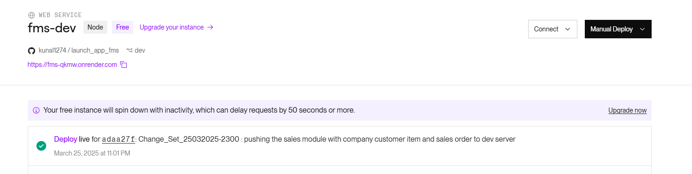

# 1. Working on the Sales module

- installing some of the important packages to be used for making the Sales module.
  winston package

  ```bash
  npm install winston
  ```

  

- Company Models

- Counter models
- Customer models
- Item Models
- Sales order Models

- index.js changes

Old index.js

```javascript
import dotenv from "dotenv";
dotenv.config(); // Loads .env into process.env

// In-built Node JS Modules Import
import expressAumMrigah from "express";

// 3rd-Party Node JS Modules Import
import mongoose from "mongoose"; // new2
import cors from "cors"; // new2

// Project FMS server related imports
import userGroupRouter from "./routes/userGroupRoutes.js";
import userRouter from "./routes/userRoutes.js";
import connectToDb from "./database/mongoDb.js";

// Environment variables
const PORT = process.env.PORT || 3000;
const MONGO_URI = process.env.MONGO_URI;

console.log("This index.js file is working as expected");
const AumMrigahApp = expressAumMrigah();

// Middleware
AumMrigahApp.use(expressAumMrigah.json());
AumMrigahApp.use(cors());

// Routes

AumMrigahApp.use("/api/users", userRouter);
AumMrigahApp.use("/api/userGroups", userGroupRouter);
//new2-end

AumMrigahApp.get("/", (req, res) => {
  res.send(`Hello from Express on Render at Port number ${PORT}!`);
});

const startServer = async () => {
  try {
    await connectToDb();
    AumMrigahApp.listen(PORT, () => {
      console.log(
        `The Node Launch FMS server 1.0.0 has been now running at ${PORT} with the cloud Mongo db`
      );
    });
  } catch (error) {
    console.error(`Server is unable to start due to some error : ${error}`);
    process.exit(1);
  }
};

startServer();
```

and New index.js

```javascript
import dotenv from "dotenv";
dotenv.config(); // Loads .env into process.env

// In-built Node JS Modules Import
import expressAumMrigah from "express";

// 3rd-Party Node JS Modules Import
import cors from "cors"; // new2

// Project FMS server related imports
import userGroupRouter from "./routes/userGroupRoutes.js";
import userRouter from "./routes/userRoutes.js";
import connectToDb from "./database/mongoDb.js";
import { companyRouter } from "./routes/company.routes.js";
import { customerRouter } from "./routes/customer.routes.js";
import { itemRouter } from "./routes/item.routes.js";
import { salesOrderRouter } from "./routes/salesorder.routes.js";

// Environment variables
const PORT = process.env.PORT || 3000;

console.log("This index.js file is working as expected");
const AumMrigahApp = expressAumMrigah();

// Middleware
AumMrigahApp.use(expressAumMrigah.json());

const allowedOrigins = process.env.ALLOWED_ORIGINS
  ? process.env.ALLOWED_ORIGINS.split(",").map((ele) => {
      return ele.trim();
    })
  : [];

console.log("Allowed Origins", process.env.ALLOWED_ORIGINS);

const corsOptions = {
  origin: (origin, callback) => {
    // Allow requests with no origin (for Postman, mobile apps)
    if (!origin || allowedOrigins.includes(origin)) {
      callback(null, true);
    } else {
      callback(new Error("Not allowed by CORS"));
    }
  },
  methods: ["GET", "POST", "PUT", "PATCH", "DELETE"],
  credentials: true, // Allow cookies
};

AumMrigahApp.use(cors(corsOptions));

// Routes
AumMrigahApp.get("/", (req, res) => {
  res.send(`Hello from Express on Render at Port number ${PORT}!`);
});

AumMrigahApp.use("/fms/api/v0/users", userRouter);
AumMrigahApp.use("/fms/api/v0/userGroups", userGroupRouter);
AumMrigahApp.use("/fms/api/v0/customers", customerRouter);
AumMrigahApp.use("/fms/api/v0/items", itemRouter);
AumMrigahApp.use("/fms/api/v0/companies", companyRouter);
AumMrigahApp.use("/fms/api/v0/salesorders", salesOrderRouter);
AumMrigahApp.get("/env", (req, res) => {
  res.json({ allowedOrigins });
});

// final route
AumMrigahApp.use((req, res) => {
  res
    .status(400)
    .send(
      `This is final and invalid path coming from node js backend launch-app-fms`
    );
});

const startServer = async () => {
  try {
    await connectToDb();
    AumMrigahApp.listen(PORT, () => {
      console.log(
        `The Node Launch FMS backend server 1.0.0 has been now running at ${PORT} with the cloud Mongo db`
      );
    });
  } catch (error) {
    console.error(`Server is unable to start due to some error : ${error}`);
    process.exit(1);
  }
};

startServer();
```

changes are as below


# 2. after the changes deploy this changes to dev server

- checking the git status
  git status


- setting the branch to dev server or dev branch
  git branch -m dev
  git add .
  git commit -m "changeset details"
  git push -u origin dev


and finally it updated in git server


# 3. lets verify the render website as well

we have to add the new variables for allowed origins

ALLOWED_ORIGINS=http://localhost:5173,http://localhost:5174,http://localhost:5175,https://namami-fe.vercel.app,https://www.postman.com,https://jiodriversprod1.vercel.app


deployment is automatically done



since the variables are coming undefined .. lets redeploy it again to check ..


after redeploy its working now on allowed origins


we should perform some testing to check if its working or not ..
