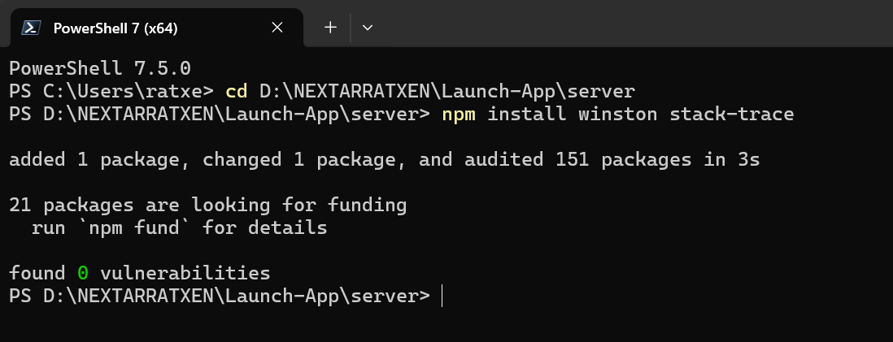
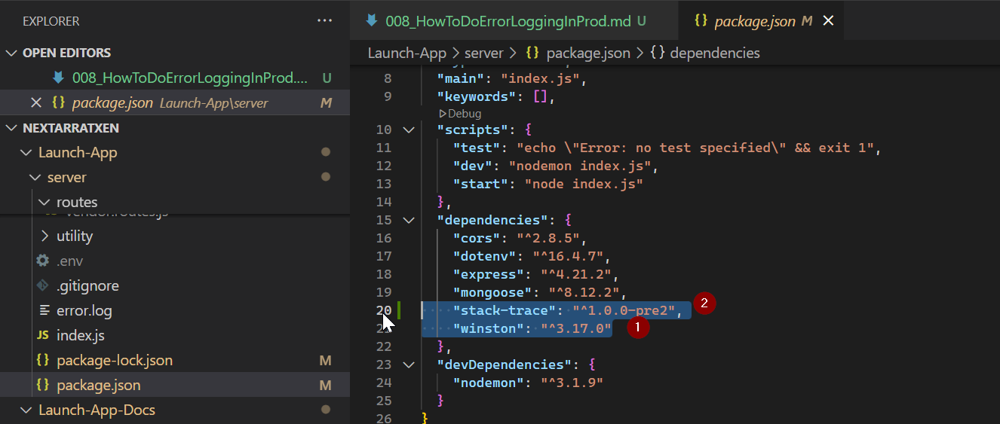
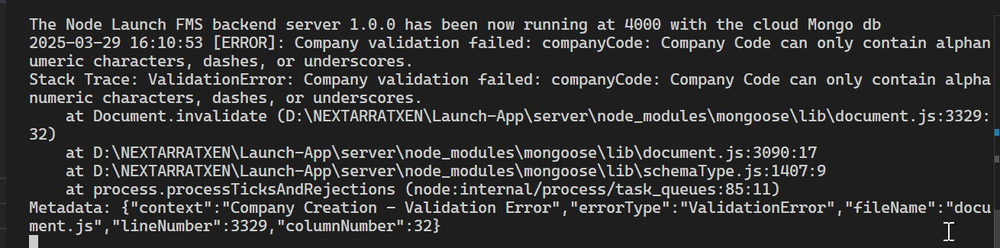
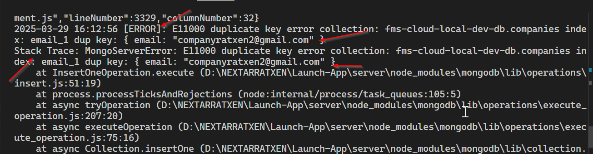
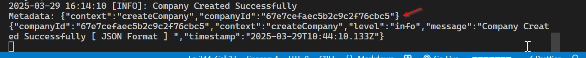
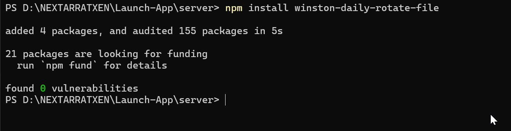
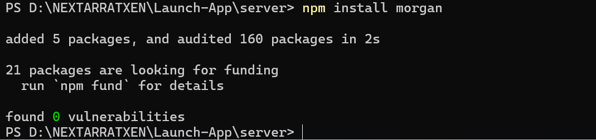

# 1. Install Winston library and stack trace

```bash
npm install winston stack-trace
```


the pacakge.json file will change with this new installation -

```json
{
  "name": "server",
  "version": "1.0.0",
  "description": "server for fms backend",
  "license": "ISC",
  "author": "Ratxen Solutions Private Limited",
  "type": "module",
  "main": "index.js",
  "keywords": [],
  "scripts": {
    "test": "echo \"Error: no test specified\" && exit 1",
    "dev": "nodemon index.js",
    "start": "node index.js"
  },
  "dependencies": {
    "cors": "^2.8.5",
    "dotenv": "^16.4.7",
    "express": "^4.21.2",
    "mongoose": "^8.12.2",
    "stack-trace": "^1.0.0-pre2",
    "winston": "^3.17.0"
  },
  "devDependencies": {
    "nodemon": "^3.1.9"
  }
}
```



# 2. Create the logger.js in the utility folder

Create a dedicated winston logger file
Explanation:
Transports: Defines where logs are sent. Here, logs are sent to the console and two files: error.log for error-level logs and combined.log for all logs.

Formats:

Timestamp: Adds a timestamp to each log.

Errors: Captures the stack trace.

Printf: Customizes the log output format, including the timestamp, log level, message, stack trace, and any additional metadata.

Exception and Rejection Handlers: Captures unhandled exceptions and promise rejections.

```javascript
// logger.js
import winston from "winston";
import path from "path";

// Custom format to include timestamp, level, message, and metadata
const customFormat = winston.format.combine(
  winston.format.timestamp({ format: "YYYY-MM-DD HH:mm:ss" }),
  winston.format.errors({ stack: true }), // Capture stack trace
  winston.format.printf(({ timestamp, level, message, stack, ...meta }) => {
    let log = `${timestamp} [${level.toUpperCase()}]: ${message}`;
    if (stack) {
      log += `\nStack Trace: ${stack}`;
    }
    // Include additional metadata if present
    if (Object.keys(meta).length > 0) {
      log += `\nMetadata: ${JSON.stringify(meta)}`;
    }
    return log;
  })
);

// Define log levels and colors if needed
const logger = winston.createLogger({
  level: "info", // Default log level
  format: customFormat,
  transports: [
    new winston.transports.Console(),
    new winston.transports.File({ filename: "logs/error.log", level: "error" }),
    new winston.transports.File({ filename: "logs/combined.log" }),
  ],
  exceptionHandlers: [
    new winston.transports.File({ filename: "logs/exceptions.log" }),
  ],
  rejectionHandlers: [
    new winston.transports.File({ filename: "logs/rejections.log" }),
  ],
});

export default logger;
```

- Further enhancing the log error file with the below :

```javascript
// logger.js (continued)
import stackTrace from "stack-trace";

/**
 * Logs an error with detailed information.
 *
 * @param {string} context - The context or location where the error occurred.
 * @param {Error} error - The error object to log.
 */
export const logError = (context, error) => {
  const trace = stackTrace.parse(error);
  const caller = trace[0]; // Get the first stack trace item relevant to the error

  const errorDetails = {
    context,
    errorType: error.name || "Error",
    message: error.message || "No message",
    stack: error.stack,
    fileName: caller ? path.basename(caller.getFileName()) : "unknown",
    lineNumber: caller ? caller.getLineNumber() : "unknown",
    columnNumber: caller ? caller.getColumnNumber() : "unknown",
  };

  logger.error(errorDetails);
};
```

Explanation:
Stack Trace Parsing: Using stack-trace, we parse the error's stack to extract the file name, line number, and column number where the error originated.

Error Details: Constructs a detailed error object containing:

Context: A string indicating where in the code the error occurred.

Error Type: The name/type of the error.

Message: The error message.

Stack: The full stack trace.

File Name, Line Number, Column Number: Precise location of the error.

Logging: Uses the configured Winston logger to log the error at the "error" level.

# 3. Integrating Winston with Company Controllers

first modifying the company create controllers

with the logger.util.js as below

```javascript
// logger.js
import winston from "winston";
import path from "path";
import * as stackTrace from "stack-trace";

// Custom format to include timestamp, level, message, and metadata
const customFormat = winston.format.combine(
  winston.format.timestamp({ format: "YYYY-MM-DD HH:mm:ss" }),
  winston.format.errors({ stack: true }), // Capture stack trace
  winston.format.printf(({ timestamp, level, message, stack, ...meta }) => {
    let log = `${timestamp} [${level.toUpperCase()}]: ${message}`;
    if (stack) {
      log += `\nStack Trace: ${stack}`;
    }
    // Include additional metadata if present
    if (Object.keys(meta).length > 0) {
      log += `\nMetadata: ${JSON.stringify(meta)}`;
    }
    return log;
  })
);

const jsonFormat = winston.format.combine(
  winston.format.timestamp(),
  winston.format.errors({ stack: true }),
  winston.format.json()
);

export const loggerJsonFormat = winston.createLogger({
  level: "info",
  format: jsonFormat,
  transports: [
    new winston.transports.Console(),
    new winston.transports.File({
      filename: "logs/errorJsonFormat.json",
      level: "error",
    }),
    new winston.transports.File({ filename: "logs/combinedJsonFormat.json" }),
  ],
});

// Define log levels and colors if needed
const logger = winston.createLogger({
  level: "info", // Default log level
  format: customFormat,
  transports: [
    new winston.transports.Console(),
    new winston.transports.File({ filename: "logs/error.log", level: "error" }),
    new winston.transports.File({ filename: "logs/combined.log" }),
  ],
  exceptionHandlers: [
    new winston.transports.File({ filename: "logs/exceptions.log" }),
  ],
  rejectionHandlers: [
    new winston.transports.File({ filename: "logs/rejections.log" }),
  ],
});

export const logStackError = (context, error) => {
  // `stackTrace.parse(error)` returns an array of CallSite objects
  const parsedStack = stackTrace.parse(error);
  const caller = parsedStack[0]; // or find the specific call site you want
  //   const trace = stackTrace.parse(error);
  //   const caller = trace[0]; // Get the first stack trace item relevant to the error

  const errorDetails = {
    context,
    errorType: error.name || "Error",
    message: error.message || "No message",
    stack: error.stack,
    fileName: caller ? path.basename(caller.getFileName()) : "unknown",
    lineNumber: caller ? caller.getLineNumber() : "unknown",
    columnNumber: caller ? caller.getColumnNumber() : "unknown",
  };

  logger.error(errorDetails);
};

export default logger;
```

```javascript
export const createCompany = async (req, res) => {
  try {
    const companyData = req.body;

    // Validate required fields
    if (
      !companyData.companyCode ||
      !companyData.companyName ||
      !companyData.primaryGSTAddress ||
      !companyData.email
    ) {
      logger.warn("Company Creation - Missing Required Fields", {
        context: "createCompany",
        body: companyData,
      });

      loggerJsonFormat.warn(
        "Company Creation - Missing Required Fields [ JSON Format ] ",
        {
          context: "createCompany",
          body: companyData,
        }
      );

      return res.status(422).json({
        status: "failure",
        message:
          "Company code, company name, primary GST address, and email are required.",
      });
    }

    // Create the company document
    const company = await CompanyModel.create(companyData);
    // winstonLogger.info(`Company created successfully: ${company._id}`);
    logger.info("Company Created Successfully", {
      context: "createCompany",
      companyId: company._id,
      timestamp: new Date().toISOString(),
    });
    loggerJsonFormat.info("Company Created Successfully [ JSON Format ] ", {
      context: "createCompany",
      companyId: company._id,
      timestamp: new Date().toISOString(),
    });

    return res.status(201).json({
      status: "success",
      message: "Company created successfully.",
      data: company,
    });
  } catch (error) {
    // Handle specific error types
    if (error instanceof mongoose.Error.ValidationError) {
      logStackError("Company Creation - Validation Error", error);
      return res.status(422).send({
        status: "failure",
        message: "Validation error during customer creation.",
        error: error.message,
      });
    }

    if (error.code === 11000) {
      logStackError("Company Creation - Duplicate Error", error);
      return res.status(409).send({
        status: "failure",
        message: "A company with this code number or email id  already exists.",
      });
    }

    if (error.message.includes("network error")) {
      logStackError("Company Creation - Network Error", error);
      return res.status(503).send({
        status: "failure",
        message: "Service temporarily unavailable. Please try again later.",
      });
    }

    // General Server Error
    logStackError("Company Creation - Unknown Error", error);
    return res.status(500).send({
      status: "failure",
      message:
        "An unexpected error occurred. Please try again. It could be internal server error which is unknown ",
      error: error.message,
    });
  }
};
```

for example one of the validation error looks like below :
when payload json was -

```json
{
  "companyCode": "REL MART",
  "companyName": "Ratxen Solutions Private Limited",
  "primaryGSTAddress": "Gurguragm sector 17c 122101",
  "secondaryOfficeAddress": "",
  "tertiaryShippingAddress": "",
  "logoImage": "",
  "email": "companyRatxen2@gmail.com",
  "contactNumber": 4949489585,
  "website": "https://www.ratxen.com"
}
```



Another duplicate email or code error -


on successful creation -


# 4. Log Rotation: Prevent log files from growing indefinitely by implementing log rotation. Use the winston-daily-rotate-file transport.

```bash
npm install winston-daily-rotate-file
```



- to log uncaught exceptions we can use

```javascript
// Log uncaught exceptions and unhandled rejections
process.on("uncaughtException", (error) => {
  logger.error("Uncaught Exception", { error });
  process.exit(1);
});

process.on("unhandledRejection", (reason, promise) => {
  logger.error("Unhandled Rejection at Promise", { reason, promise });
  // Optionally exit the process
});
```

- After daily-rotate file has been implemented the file will looke like

```javascript
// logger.js
import winston from "winston";
import path from "path";
import * as stackTrace from "stack-trace"; // stack trace is written in common js
import DailyRotateFile from "winston-daily-rotate-file";

// IN-USE : Custom format to include timestamp, level, message, and metadata
const customFormat = winston.format.combine(
  winston.format.timestamp({ format: "YYYY-MM-DD HH:mm:ss" }),
  winston.format.errors({ stack: true }), // Capture stack trace
  winston.format.printf(({ timestamp, level, message, stack, ...meta }) => {
    let log = `${timestamp} [${level.toUpperCase()}]: ${message}`;
    if (stack) {
      log += `\nStack Trace: ${stack}`;
    }
    // Include additional metadata if present
    if (Object.keys(meta).length > 0) {
      log += `\nMetadata: ${JSON.stringify(meta)}`;
    }
    return log;
  })
);

// IN-USE :  Define transports
// ADDED
const transports = [
  new winston.transports.Console(),
  new DailyRotateFile({
    filename: "logs/application-%DATE%.log",
    datePattern: "YYYY-MM-DD",
    zippedArchive: true,
    maxSize: "20m",
    maxFiles: "14d",
  }),
  new winston.transports.File({ filename: "logs/error.log", level: "error" }),
  new winston.transports.File({ filename: "logs/combined.log" }),
];

// NOT-IN-USE : will be used in company controllers for time being
const jsonFormat = winston.format.combine(
  winston.format.timestamp(),
  winston.format.errors({ stack: true }),
  winston.format.json()
);

// NOT-IN-USE : we wont use it for now just for testing will be used in company controllers
export const loggerJsonFormat = winston.createLogger({
  level: "info",
  format: jsonFormat,
  transports: [
    new winston.transports.Console(),
    new winston.transports.File({
      filename: "logs/errorJsonFormat.json",
      level: "error",
    }),
    new winston.transports.File({ filename: "logs/combinedJsonFormat.json" }),
  ],
});

// Define log levels and colors if needed
const logger = winston.createLogger({
  //level: "info", // Default log level
  level: process.env.NODE_ENV === "production" ? "info" : "debug", // based on environment : CHANGED
  format: customFormat,
  // removed
  //   transports: [
  //     new winston.transports.Console(),
  //     new winston.transports.File({ filename: "logs/error.log", level: "error" }),
  //     new winston.transports.File({ filename: "logs/combined.log" }),
  //   ],
  transports,
  exceptionHandlers: [
    new winston.transports.File({ filename: "logs/exceptions.log" }),
  ],
  rejectionHandlers: [
    new winston.transports.File({ filename: "logs/rejections.log" }),
  ],
});

// Log uncaught exceptions and unhandled rejections
process.on("uncaughtException", (error) => {
  logger.error("Uncaught Exception", { error });
  process.exit(1);
});

process.on("unhandledRejection", (reason, promise) => {
  logger.error("Unhandled Rejection at Promise", { reason, promise });
  // Optionally exit the process
});

export const logStackError = (context, error) => {
  // `stackTrace.parse(error)` returns an array of CallSite objects
  const parsedStack = stackTrace.parse(error);
  const caller = parsedStack[0]; // or find the specific call site you want
  //   const trace = stackTrace.parse(error);
  //   const caller = trace[0]; // Get the first stack trace item relevant to the error

  const errorDetails = {
    context,
    errorType: error.name || "Error",
    message: error.message || "No message",
    stack: error.stack,
    fileName: caller ? path.basename(caller.getFileName()) : "unknown",
    lineNumber: caller ? caller.getLineNumber() : "unknown",
    columnNumber: caller ? caller.getColumnNumber() : "unknown",
  };

  logger.error(errorDetails);
};

export default logger;
```

# 5. Finally we use the morgan

Middleware for Request Logging: Implement middleware to log incoming HTTP requests, responses, and their statuses. Libraries like morgan can be integrated with Winston.

```bash
npm install morgan
```



the current file is index.js

```javascript
import dotenv from "dotenv";
dotenv.config(); // Loads .env into process.env

// In-built Node JS Modules Import
import expressAumMrigah from "express";

// 3rd-Party Node JS Modules Import
import cors from "cors"; // new2

// Project FMS server related imports
import userGroupRouter from "./routes/userGroupRoutes.js";
import userRouter from "./routes/userRoutes.js";
import connectToDb from "./database/mongoDb.js";
import { companyRouter } from "./routes/company.routes.js";
import { customerRouter } from "./routes/customer.routes.js";
import { itemRouter } from "./routes/item.routes.js";
import { salesOrderRouter } from "./routes/salesorder.routes.js";
import { vendorRouter } from "./routes/vendor.routes.js";
import { purchaseOrderRouter } from "./routes/purchaseorder.routes.js";

// Environment variables
const PORT = process.env.PORT || 3000;

console.log("This index.js file is working as expected");
const AumMrigahApp = expressAumMrigah();

// Middleware
AumMrigahApp.use(expressAumMrigah.json());

const allowedOrigins = process.env.ALLOWED_ORIGINS
  ? process.env.ALLOWED_ORIGINS.split(",").map((ele) => {
      return ele.trim();
    })
  : [];

console.log("Allowed Origins", process.env.ALLOWED_ORIGINS);

const corsOptions = {
  origin: (origin, callback) => {
    // Allow requests with no origin (for Postman, mobile apps)
    if (!origin || allowedOrigins.includes(origin)) {
      callback(null, true);
    } else {
      callback(new Error("Not allowed by CORS"));
    }
  },
  methods: ["GET", "POST", "PUT", "PATCH", "DELETE"],
  credentials: true, // Allow cookies
};

AumMrigahApp.use(cors(corsOptions));

// Routes
AumMrigahApp.get("/", (req, res) => {
  res.send(`Hello from Express on Render at Port number ${PORT}!`);
});

AumMrigahApp.use("/fms/api/v0/users", userRouter);
AumMrigahApp.use("/fms/api/v0/userGroups", userGroupRouter);
AumMrigahApp.use("/fms/api/v0/customers", customerRouter);
AumMrigahApp.use("/fms/api/v0/vendors", vendorRouter);
AumMrigahApp.use("/fms/api/v0/items", itemRouter);
AumMrigahApp.use("/fms/api/v0/companies", companyRouter);
AumMrigahApp.use("/fms/api/v0/salesorders", salesOrderRouter);
AumMrigahApp.use("/fms/api/v0/purchaseorders", purchaseOrderRouter);

AumMrigahApp.get("/env", (req, res) => {
  res.json({ allowedOrigins });
});

// final route
AumMrigahApp.use((req, res) => {
  res
    .status(400)
    .send(
      `This is final and invalid path coming from node js backend launch-app-fms`
    );
});

const startServer = async () => {
  try {
    await connectToDb();
    AumMrigahApp.listen(PORT, () => {
      console.log(
        `The Node Launch FMS backend server 1.0.0 has been now running at ${PORT} with the cloud Mongo db`
      );
    });
  } catch (error) {
    console.error(`Server is unable to start due to some error : ${error}`);
    process.exit(1);
  }
};

startServer();
```

and the latest changes are -

```javascript
import dotenv from "dotenv";
dotenv.config(); // Loads .env into process.env

// In-built Node JS Modules Import
import expressAumMrigah from "express";

// 3rd-Party Node JS Modules Import
import cors from "cors"; // new2
import morgan from "morgan";

// Project FMS server related imports
import userGroupRouter from "./routes/userGroupRoutes.js";
import userRouter from "./routes/userRoutes.js";
import connectToDb from "./database/mongoDb.js";
import { companyRouter } from "./routes/company.routes.js";
import { customerRouter } from "./routes/customer.routes.js";
import { itemRouter } from "./routes/item.routes.js";
import { salesOrderRouter } from "./routes/salesorder.routes.js";
import { vendorRouter } from "./routes/vendor.routes.js";
import { purchaseOrderRouter } from "./routes/purchaseorder.routes.js";
import logger from "./utility/logger.util.js";

// Environment variables
const PORT = process.env.PORT || 3000;

console.log("This index.js file is working as expected");
const AumMrigahApp = expressAumMrigah();

// Middleware

AumMrigahApp.use(expressAumMrigah.json());

const allowedOrigins = process.env.ALLOWED_ORIGINS
  ? process.env.ALLOWED_ORIGINS.split(",").map((ele) => {
      return ele.trim();
    })
  : [];

console.log("Allowed Origins", process.env.ALLOWED_ORIGINS);

const corsOptions = {
  origin: (origin, callback) => {
    // Allow requests with no origin (for Postman, mobile apps)
    if (!origin || allowedOrigins.includes(origin)) {
      callback(null, true);
    } else {
      callback(new Error("Not allowed by CORS"));
    }
  },
  methods: ["GET", "POST", "PUT", "PATCH", "DELETE"],
  credentials: true, // Allow cookies
};

AumMrigahApp.use(cors(corsOptions));

// we are using after the request processed through json and cors
// Define a stream for morgan to use Winston
const stream = {
  write: (message) => logger.http(message.trim()),
};

AumMrigahApp.use(morgan("combined", { stream }));

// Routes
AumMrigahApp.get("/", (req, res) => {
  res.send(`Hello from Express on Render at Port number ${PORT}!`);
});

AumMrigahApp.use("/fms/api/v0/users", userRouter);
AumMrigahApp.use("/fms/api/v0/userGroups", userGroupRouter);
AumMrigahApp.use("/fms/api/v0/customers", customerRouter);
AumMrigahApp.use("/fms/api/v0/vendors", vendorRouter);
AumMrigahApp.use("/fms/api/v0/items", itemRouter);
AumMrigahApp.use("/fms/api/v0/companies", companyRouter);
AumMrigahApp.use("/fms/api/v0/salesorders", salesOrderRouter);
AumMrigahApp.use("/fms/api/v0/purchaseorders", purchaseOrderRouter);

AumMrigahApp.get("/env", (req, res) => {
  res.json({ allowedOrigins });
});

// Global error handler (optional but recommended)
AumMrigahApp.use((err, req, res, next) => {
  logger.error("Global Error Handler", { error: err });
  res.status(500).send({
    status: "failure",
    message: "An unexpected error occurred from the Backend for launch-app-fms",
  });
});

// final route
AumMrigahApp.use((req, res) => {
  res
    .status(400)
    .send(
      `This is final and invalid path coming from node js backend launch-app-fms`
    );
});

const startServer = async () => {
  try {
    await connectToDb();
    AumMrigahApp.listen(PORT, () => {
      console.log(
        `The Node Launch FMS backend server 1.0.0 has been now running at ${PORT} with the cloud Mongo db`
      );
    });
  } catch (error) {
    console.error(`Server is unable to start due to some error : ${error}`);
    process.exit(1);
  }
};

startServer();
```
