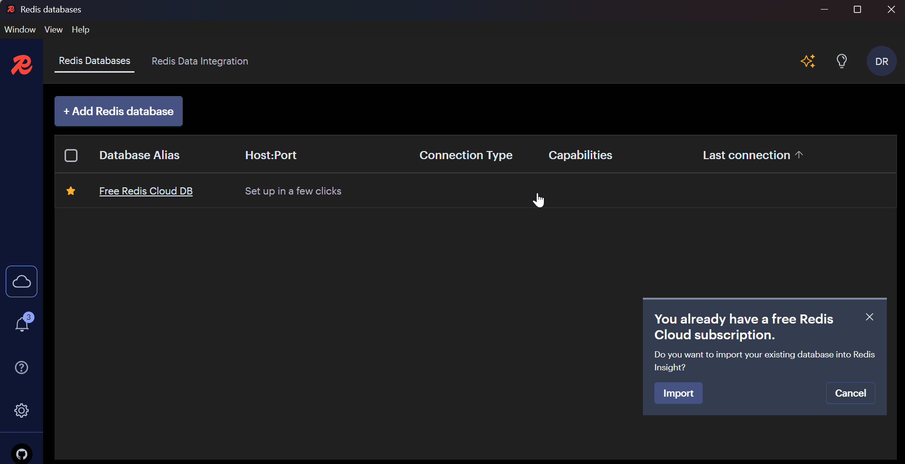
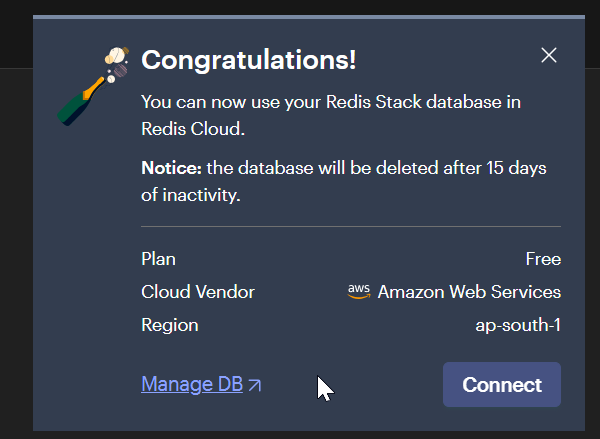

# 1.1. Installing redis on windows or lets use it for cloud version

Google log in with devratxen@gmail.com

https://cloud.redis.io/#/new-customer/new-database


Redis insight desktop





### lets do install redis on windows as first option

https://redis.io/docs/latest/operate/oss_and_stack/install/install-redis/

# 1.2 Implementing Caching - lets try redis at the backend first

Install Redis Client
Inside your backend folder (where your Express server is located), install the official Node.js Redis client:

```bash
npm install redis
```


and new package json is as below

```json
{
  "name": "server",
  "version": "1.0.0",
  "description": "server for fms backend",
  "license": "ISC",
  "author": "Ratxen Solutions Private Limited",
  "type": "module",
  "main": "index.js",
  "keywords": [],
  "scripts": {
    "test": "echo \"Error: no test specified\" && exit 1",
    "dev": "nodemon index.js",
    "start": "node index.js"
  },
  "dependencies": {
    "cors": "^2.8.5",
    "dotenv": "^16.4.7",
    "express": "^4.21.2",
    "mongoose": "^8.12.2",
    "morgan": "^1.10.0",
    "redis": "^4.7.0", // new
    "stack-trace": "^1.0.0-pre2",
    "winston": "^3.17.0",
    "winston-daily-rotate-file": "^5.0.0"
  },
  "devDependencies": {
    "nodemon": "^3.1.9"
  }
}
```

# 2. create a middleware folder

Create a Redis Client (ESM Version)
Inside your backend (or wherever your Express code is), create a file named something like redisClient.js. This file initializes and exports an already-connected Redis client using ES modules.


```javascript
// redisClient.js
import { createClient } from "redis";

const {
  REDIS_HOST,
  REDIS_PORT,
  REDIS_PASSWORD,
  REDIS_USERNAME,
  REDIS_USE_TLS,
} = process.env;

const socketConfig = {
  host: REDIS_HOST,
  port: Number(REDIS_PORT),
};

// If TLS is required (e.g., some Redis providers expect SSL/TLS connections)
if (REDIS_USE_TLS === "true") {
  socketConfig.tls = true;
}

// // Optionally, load ENV vars or set defaults
// const REDIS_HOST = process.env.REDIS_HOST || "127.0.0.1";
// const REDIS_PORT = process.env.REDIS_PORT || 6379;
// const REDIS_PASSWORD = process.env.REDIS_PASSWORD || ""; // if needed

const redisClient = createClient({
  socket: socketConfig,
  // If your provider requires username + password (for example, Redis Enterprise Cloud)
  // some providers let you do: url: `redis://:${REDIS_PASSWORD}@${REDIS_HOST}:${REDIS_PORT}`
  username: REDIS_USERNAME, // omit if not needed
  password: REDIS_PASSWORD, // omit if not needed
});

// Log errors for better debugging
redisClient.on("error", (err) => {
  console.error("Redis Client Error:", err);
});

// Connect right away
(async () => {
  try {
    await redisClient.connect();
    console.log(`Connected to Redis on ${REDIS_HOST}:${REDIS_PORT}`);
  } catch (err) {
    console.error("Could not connect to Redis:", err);
  }
})();

export default redisClient;
```

Why do it this way?

We use an immediate async function to await redisClient.connect() so that by the time this module is imported elsewhere, the client is already connecting/connected.

This is ESM-friendly (using import/export).

# 3. Creating middleware for caching

Create a Caching Middleware
In most Express apps, you’ll want to check Redis before hitting the database. For routes that can benefit from caching (especially GET routes that return lists or frequently-read data), we can create a middleware. Let’s name it cacheMiddleware.js:

```javascript
// cacheMiddleware.js
import redisClient from "./redisClient.js";

/**
 * Caching middleware for GET requests:
 * - Uses request URL as a simple cache key, or you can customize the key logic.
 */
export async function cacheMiddleware(req, res, next) {
  try {
    // Only cache GET requests by default. If you want to cache other methods, remove this check.
    if (req.method !== "GET") {
      return next();
    }

    const cacheKey = req.originalUrl; // e.g. "/fms/api/v0/companies?archived=false"
    const cachedData = await redisClient.get(cacheKey);

    if (cachedData) {
      // If we have cached data, return it immediately
      console.log(`[Cache HIT] ${cacheKey}`);
      return res.status(200).json(JSON.parse(cachedData));
    }

    console.log(`[Cache MISS] ${cacheKey}`);
    return next(); // proceed to controller/DB
  } catch (err) {
    console.error("Error in cacheMiddleware:", err);
    return next(); // fallback if cache fails
  }
}
```

Key Points

We only attempt caching on GET by default.

If data is found in Redis (cachedData), we return it directly.

Otherwise, we proceed to the next middleware or controller.

# 4. Adding to routes

Add Caching Logic to Your Routes or Controllers
You have two main patterns to choose from:

Route-Level Caching: Attach cacheMiddleware at the router level for all GET requests, then store data in Redis inside your controller after fetching from MongoDB.

Controller-Level Caching: Skip a route-level middleware and just handle cache reads/writes directly in each controller method.

Below is the most common approach: Route-Level read from Redis, and Controller sets Redis after database fetch.

```javascript
// routes/1_0_0/company.routes.js

import express from "express";
import {
  createCompany,
  getAllCompanies,
  getCompanyById,
  updateCompanyById,
  deleteCompanyById,
  archiveCompanyById,
  unarchiveCompanyById,
  getArchivedCompanies,
} from "../controllers/company.controller.js";
import { cacheMiddleware } from "../middleware/cacheMiddleware.js";

const companyRouter = express.Router();

// Example: GET all companies, use cacheMiddleware
// 1) cacheMiddleware checks if data is already in Redis
// 2) If found, returns immediately
// 3) If not found, calls getAllCompanies

companyRouter.post("/", createCompany);
companyRouter.get("/archived", getArchivedCompanies); // Must be defined before :companyId route
companyRouter.get("/", cacheMiddleware, getAllCompanies); // ADDED
companyRouter.get("/:companyId", getCompanyById);
companyRouter.put("/:companyId", updateCompanyById);
companyRouter.delete("/:companyId", deleteCompanyById);
companyRouter.patch("/:companyId/archive", archiveCompanyById);
companyRouter.patch("/:companyId/unarchive", unarchiveCompanyById);

export { companyRouter };
```

- and now adding to the controller

In Your getAllCompanies Controller
When the route is a “cache miss,” your controller will fetch data from MongoDB, then store it in Redis. For example:

for gettign all companies we are changing

```javascript
export const getAllCompanies = async (req, res) => {
  try {
    const companies = await CompanyModel.find();

    // ADDED - START
    // 2) store it in Redis for subsequent requests
    // use the same key used in the cacheMiddleware
    const cacheKey = req.originalUrl; // e.g. "/fms/api/v0/companies"
    await redisClient.set(cacheKey, JSON.stringify(companies), {
      EX: 60 * 5, // expire in 5 minutes
    });
    // ADDED - END

    logger.info("Fetched All Companies", {
      context: "getAllCompanies",
      count: companies.length,
    });
    loggerJsonFormat.info("Fetched All Companies", {
      context: "getAllCompanies",
      count: companies.length,
    });
    //winstonLogger.info(`Retrieved ${companies.length} companies.`);
    return res.status(200).json({
      status: "success",
      message: "Companies retrieved successfully.",
      count: companies.length,
      data: companies,
    });
  } catch (error) {
    logStackError("Get All Companies - Fetch Error ", error);
    return res.status(500).json({
      status: "failure",
      message: "Internal Server Error while fetching the Companies",
      error: error.message,
    });
  }
};
```

Now:

On the first request to /fms/api/v0/companies, the cache is empty → cacheMiddleware calls next() → getAllCompanies queries MongoDB → saves the result in Redis.

On subsequent requests within 5 minutes, cacheMiddleware will serve data directly from Redis, skipping MongoDB.

# 5. Invalidate data / Update When data changes

Invalidate / Update Cache When Data Changes
Whenever you create, update, or delete a Company, the previously cached data may be stale. You can:

Delete the cached key so that on the next GET request, the data will be freshly fetched.

Or update the cache if you have the new data immediately.

# 6. REdis is able to connect now

Environment was modified -
and the script ws changed -

```javascript
// redisClient.js
import { createClient } from "redis";

const {
  REDIS_HOST,
  REDIS_PORT,
  REDIS_PASSWORD,
  REDIS_USERNAME,
  REDIS_USE_TLS,
} = process.env;

const socketConfig = {
  host: REDIS_HOST,
  port: Number(REDIS_PORT),
};

// If TLS is required (e.g., some Redis providers expect SSL/TLS connections)
if (REDIS_USE_TLS === "true") {
  socketConfig.tls = {};
}

// // Optionally, load ENV vars or set defaults
// const REDIS_HOST = process.env.REDIS_HOST || "127.0.0.1";
// const REDIS_PORT = process.env.REDIS_PORT || 6379;
// const REDIS_PASSWORD = process.env.REDIS_PASSWORD || ""; // if needed

const redisClient = createClient({
  socket: socketConfig,
  // If your provider requires username + password (for example, Redis Enterprise Cloud)
  // some providers let you do: url: `redis://:${REDIS_PASSWORD}@${REDIS_HOST}:${REDIS_PORT}`
  username: REDIS_USERNAME, // omit if not needed
  password: REDIS_PASSWORD, // omit if not needed
});

// Log errors for better debugging
redisClient.on("error", (err) => {
  console.error("Redis Client Error:", err);
});

// Connect right away
(async () => {
  try {
    await redisClient.connect();
    console.log(`Connected to Redis on ${REDIS_HOST}:${REDIS_PORT}`);
  } catch (err) {
    console.error("Could not connect to Redis:", err);
  }
})();

export default redisClient;
```


redis insight desktop is also done


and you will get the password from hre


# 7. Redis testing with the data


with get all companies first time with CACHE MISS ( > 150ms +)


but with Cache HIT ( > 50ms + . it has been reduced by 100 ms )


with this redis has been implemented and tested here.
