# 1. first check git status

```bash
git status
```

upon checking git status it will throw error
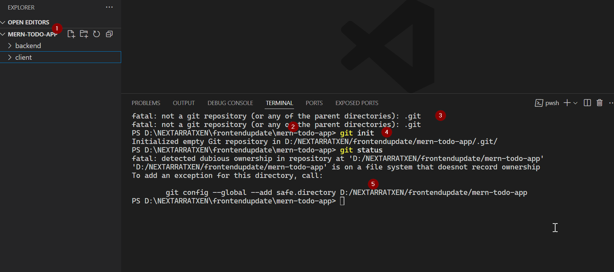

and then do git init and then git status

```bash
git init
```

```bash
git status
```

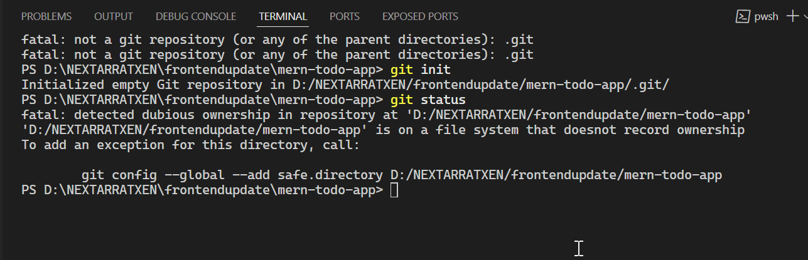

now safe the repository first
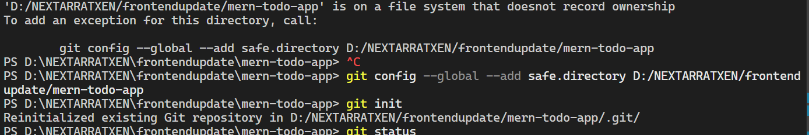

- add gitignore
  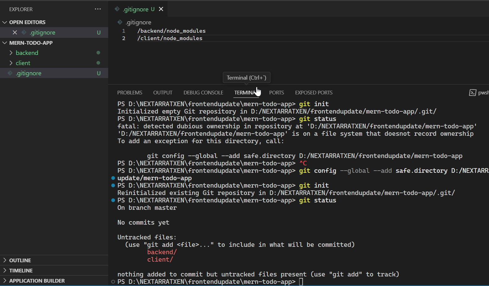

- now do

```bash
git add .
```

or

```bash
git add backend
```

and

```bash
git add client
```

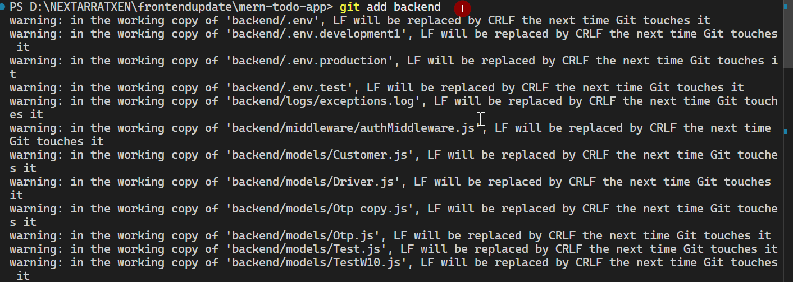

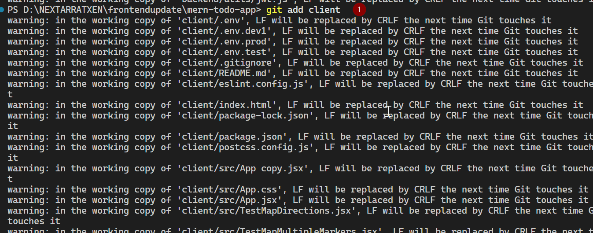

# create a remote git repo

```bash
gh repo create mern-todo-dev --public --source=. --remote=origin
```

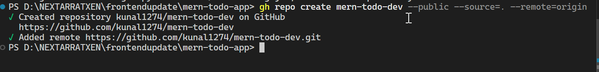

- git commit now

```bash
git commit -m "Change_Set_29032025_1916 : To do app first push to the git"
```

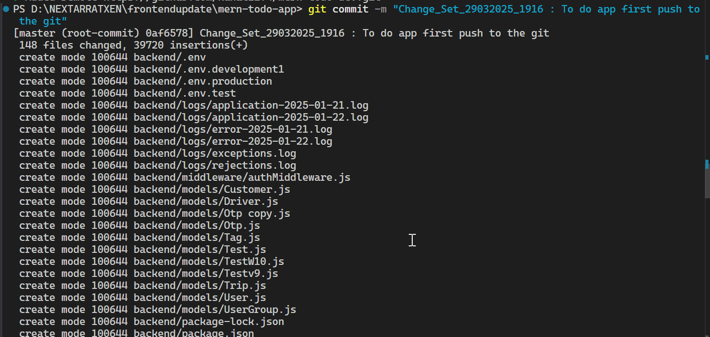
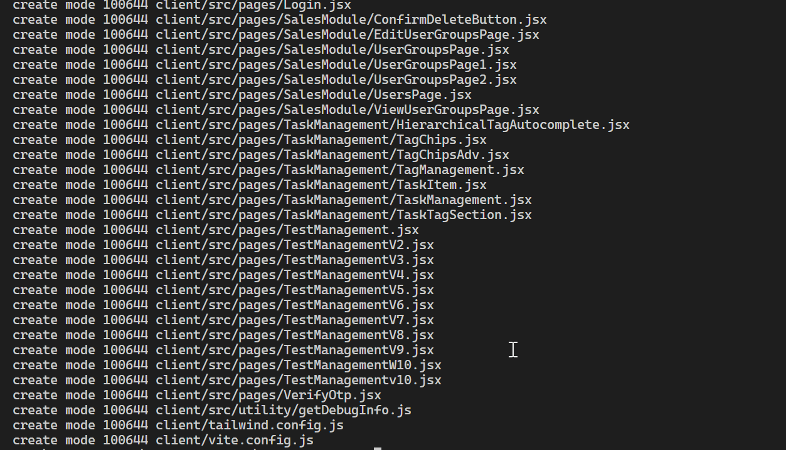

- now push to the branch main
  while pushing it will throw error as we have not removed the environment variable

```bash
git branch -m main
git push - u origin main
```

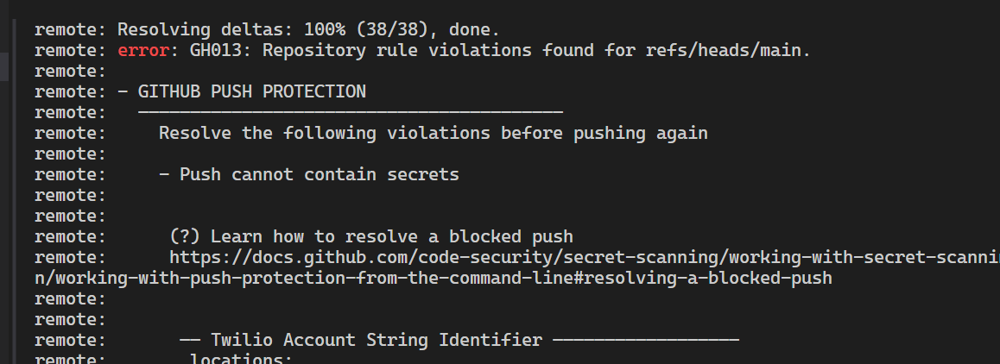

I am allowing it for testing purpose for now but we can also do put in git ignore file and then push it .

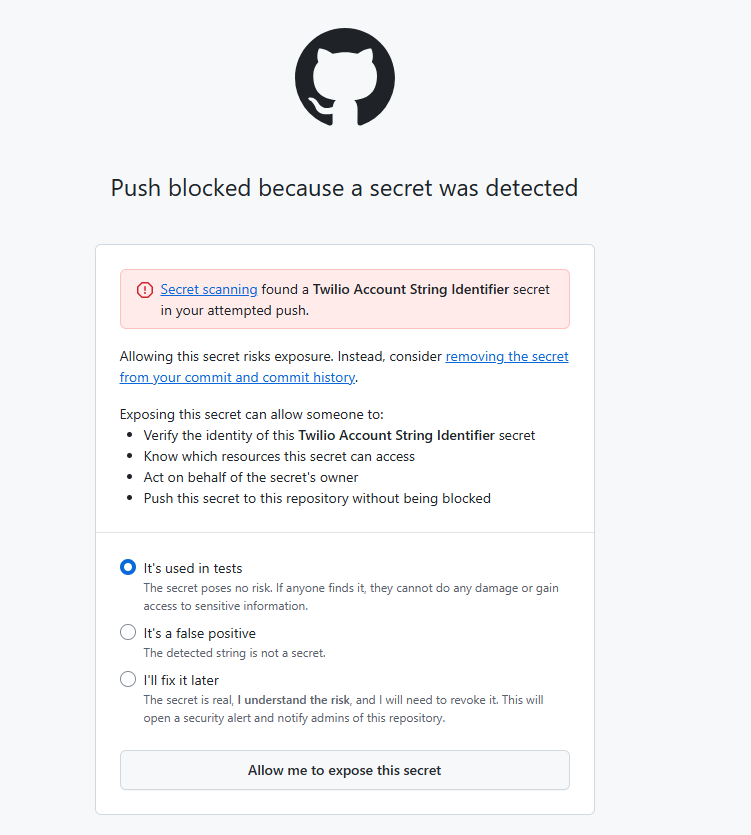
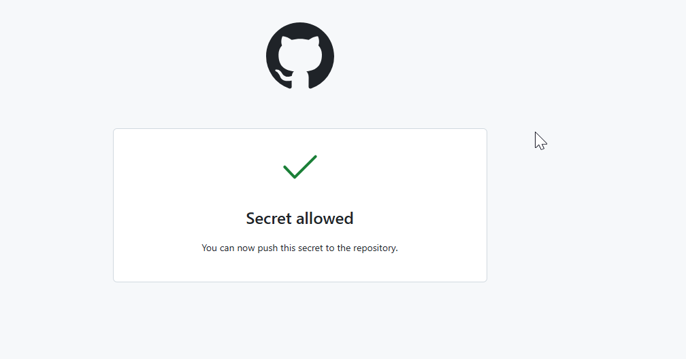

and now push is successful
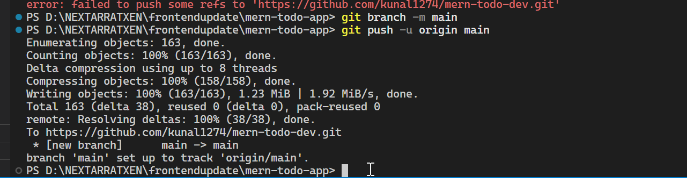

# 3. now the file is in git hub

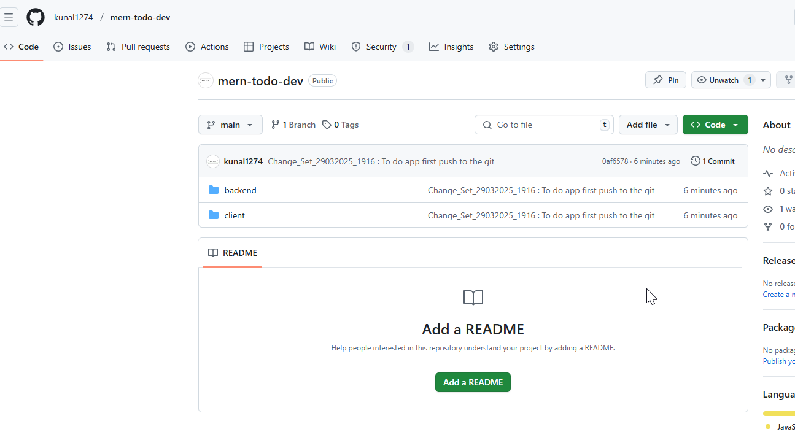
