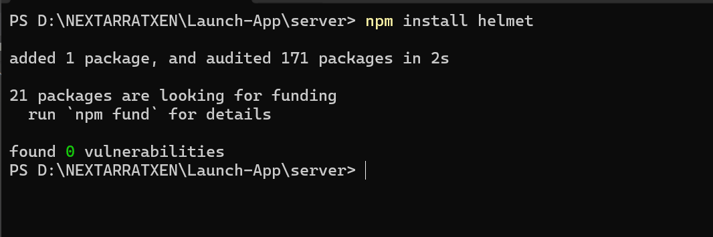
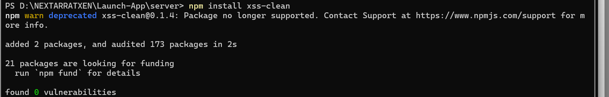
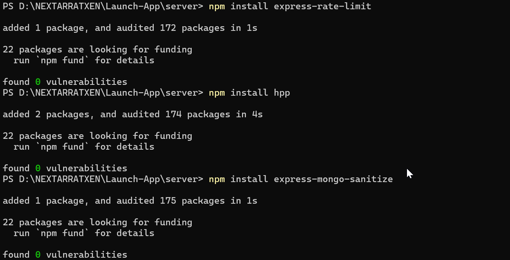

# 1. Install helmet

Use Helmet
Helmet helps you set various HTTP headers for security, e.g. X-XSS-Protection, X-Content-Type-Options, Strict-Transport-Security, etc.

```bash
npm install helmet
```

```javascript
import helmet from "helmet";

AumMrigahApp.use(helmet());
```



Enable HTTPS/TLS

If you are not behind a proxy or a platform (like Render, Heroku, AWS ELB, etc.) that terminates SSL/TLS for you, configure HTTPS on your server.

Redirect HTTP traffic to HTTPS so that all communications remain encrypted in transit.

Enforce a Strict CORS Policy

You’ve already implemented a dynamic CORS policy with a custom allowedOrigins list. Continue to restrict only the domains you trust.

In production, ensure your ALLOWED_ORIGINS environment variable is limited to your app’s actual domains.

Disable x-powered-by Header

```javascript
AumMrigahApp.disable("x-powered-by");
```

This hides the fact that your app is running on Express, making it slightly less transparent to attackers.

# 2. Install xss-clean

```bash
npm install xss-clean
```

this is deprecated



# 3. Install rate limiter and hpp and express-mongo-sanitize



```bash
npm install express-rate-limit hpp
```

express-rate-limit

To protect against denial-of-service (DoS) or brute-force attacks, use a rate limiting middleware.

```javascript
import rateLimit from "express-rate-limit";

const limiter = rateLimit({
  windowMs: 15 * 60 * 1000, // 15 minutes
  max: 100, // limit each IP to 100 requests per windowMs
  message: "Too many requests from this IP, please try again later.",
});

AumMrigahApp.use("/fms/api", limiter);
```

and hpp
HPP
What it does: Puts the array parameters in req.query and/or req.body asides and just selects the last parameter value to avoid HTTP Parameter Pollution attacks.

What does it protect against: Bypassing input validations and denial of service (DoS) attacks by uncaught TypeError in async code, leading to server crash.

```javascript
const app = require("express")();
const hpp = require("hpp");

// Protect against HPP, should come before any routes
app.use(hpp());

app.listen(1337);
```

# Express mongo sanitize

Express Mongo Sanitize
What it does: Searches for any keys in objects that begin with a $ sign or contain a . from req.body, req.query or req.params and either removes such keys and data or replaces the prohibited characters with another allowed character.

What does it protect against: MongoDB Operator Injection. Malicious users could send an object containing a $ operator, or including a ., which could change the context of a database operation

```bash
npm install express-mongo-sanitize
```

```javascript
const app = require("express")();
const mongoSanitize = require("express-mongo-sanitize");

// Remove all keys containing prohibited characters
app.use(mongoSanitize());

app.listen(1337);
```

Current index.js is as below

```javascript
import dotenv from "dotenv";
dotenv.config(); // Loads .env into process.env

// In-built Node JS Modules Import
import expressAumMrigah from "express";

// 3rd-Party Node JS Modules Import
import cors from "cors"; // new2
import morgan from "morgan";

// Project FMS server related imports
import userGroupRouter from "./routes/userGroupRoutes.js";
import userRouter from "./routes/userRoutes.js";
import connectToDb from "./database/mongoDb.js";
import { companyRouter } from "./routes/company.routes.js";
import { customerRouter } from "./routes/customer.routes.js";
import { itemRouter } from "./routes/item.routes.js";
import { salesOrderRouter } from "./routes/salesorder.routes.js";
import { vendorRouter } from "./routes/vendor.routes.js";
import { purchaseOrderRouter } from "./routes/purchaseorder.routes.js";
import logger from "./utility/logger.util.js";

// Environment variables
const PORT = process.env.PORT || 3000;

console.log("This index.js file is working as expected");
const AumMrigahApp = expressAumMrigah();

// Middleware

AumMrigahApp.use(expressAumMrigah.json());

const allowedOrigins = process.env.ALLOWED_ORIGINS
  ? process.env.ALLOWED_ORIGINS.split(",").map((ele) => {
      return ele.trim();
    })
  : [];

console.log("Allowed Origins", process.env.ALLOWED_ORIGINS);

const corsOptions = {
  origin: (origin, callback) => {
    // Allow requests with no origin (for Postman, mobile apps)
    if (!origin || allowedOrigins.includes(origin)) {
      callback(null, true);
    } else {
      callback(new Error("Not allowed by CORS"));
    }
  },
  methods: ["GET", "POST", "PUT", "PATCH", "DELETE"],
  credentials: true, // Allow cookies
};

AumMrigahApp.use(cors(corsOptions));

// we are using after the request processed through json and cors
// Define a stream for morgan to use Winston
const stream = {
  write: (message) => logger.http(message.trim()),
};

AumMrigahApp.use(morgan("combined", { stream }));

// Routes
AumMrigahApp.get("/", (req, res) => {
  res.send(`Hello from Express on Render at Port number ${PORT}!`);
});

AumMrigahApp.use("/fms/api/v0/users", userRouter);
AumMrigahApp.use("/fms/api/v0/userGroups", userGroupRouter);
AumMrigahApp.use("/fms/api/v0/customers", customerRouter);
AumMrigahApp.use("/fms/api/v0/vendors", vendorRouter);
AumMrigahApp.use("/fms/api/v0/items", itemRouter);
AumMrigahApp.use("/fms/api/v0/companies", companyRouter);
AumMrigahApp.use("/fms/api/v0/salesorders", salesOrderRouter);
AumMrigahApp.use("/fms/api/v0/purchaseorders", purchaseOrderRouter);

AumMrigahApp.get("/env", (req, res) => {
  res.json({ allowedOrigins });
});

// Global error handler (optional but recommended)
AumMrigahApp.use((err, req, res, next) => {
  logger.error("Global Error Handler", { error: err });
  res.status(500).send({
    status: "failure",
    message: "An unexpected error occurred from the Backend for launch-app-fms",
  });
});

// final route
AumMrigahApp.use((req, res) => {
  res
    .status(400)
    .send(
      `This is final and invalid path coming from node js backend launch-app-fms`
    );
});

const startServer = async () => {
  try {
    await connectToDb();
    AumMrigahApp.listen(PORT, () => {
      console.log(
        `The Node Launch FMS backend server 1.0.0 has been now running at ${PORT} with the cloud Mongo db`
      );
    });
  } catch (error) {
    console.error(`Server is unable to start due to some error : ${error}`);
    process.exit(1);
  }
};

startServer();
```

and now after change . express.json has been kept earlier.
The final code of index.js file as below

```javascript
import dotenv from "dotenv";
dotenv.config(); // Loads .env into process.env

// In-built Node JS Modules Import
import expressAumMrigah from "express";

// 3rd-Party Node JS Modules Import
import cors from "cors"; // new2
import morgan from "morgan";
import helmet from "helmet";
import xss from "xss-clean";
import rateLimit from "express-rate-limit";
import hpp from "hpp";
import ExpressMongoSanitize from "express-mongo-sanitize";

// Project FMS server related imports
import userGroupRouter from "./routes/userGroupRoutes.js";
import userRouter from "./routes/userRoutes.js";
import connectToDb from "./database/mongoDb.js";
import { companyRouter } from "./routes/company.routes.js";
import { customerRouter } from "./routes/customer.routes.js";
import { itemRouter } from "./routes/item.routes.js";
import { salesOrderRouter } from "./routes/salesorder.routes.js";
import { vendorRouter } from "./routes/vendor.routes.js";
import { purchaseOrderRouter } from "./routes/purchaseorder.routes.js";
import logger from "./utility/logger.util.js";
import { requestTimer } from "./middleware/requestTimer.js";

// Environment variables
const PORT = process.env.PORT || 3000;

console.log("This index.js file is working as expected");

// Middleware
const AumMrigahApp = expressAumMrigah();

AumMrigahApp.use(expressAumMrigah.json());

//// Security middleware
AumMrigahApp.use(helmet()); // Secure HTTP headers
AumMrigahApp.use(xss()); // Prevent XSS
AumMrigahApp.disable("x-powered-by"); // Hide the X-Powered-By header
AumMrigahApp.use(ExpressMongoSanitize());
AumMrigahApp.use(hpp());

// Rate Limiter
const limiter = rateLimit({
  windowMs: 15 * 60 * 1000,
  max: 100,
  message: "Too many requests from this IP. Please try again later.",
});
//AumMrigahApp.use("/fms/api", limiter); // specific to router
AumMrigahApp.use(limiter); // to everything

const allowedOrigins = process.env.ALLOWED_ORIGINS
  ? process.env.ALLOWED_ORIGINS.split(",").map((ele) => {
      return ele.trim();
    })
  : [];

console.log("Allowed Origins", process.env.ALLOWED_ORIGINS);

const corsOptions = {
  origin: (origin, callback) => {
    // Allow requests with no origin (for Postman, mobile apps)
    if (!origin || allowedOrigins.includes(origin)) {
      callback(null, true);
    } else {
      callback(new Error("Not allowed by CORS"));
    }
  },
  methods: ["GET", "POST", "PUT", "PATCH", "DELETE"],
  credentials: true, // Allow cookies
};

AumMrigahApp.use(cors(corsOptions));

AumMrigahApp.use(requestTimer); // 💥 log for all routes

// we are using after the request processed through json and cors
// Define a stream for morgan to use Winston
const stream = {
  write: (message) => logger.http(message.trim()),
};

AumMrigahApp.use(morgan("combined", { stream }));

// Routes
AumMrigahApp.get("/", (req, res) => {
  res.send(`Hello from Express on Render at Port number ${PORT}!`);
});

AumMrigahApp.use("/fms/api/v0/users", userRouter);
AumMrigahApp.use("/fms/api/v0/userGroups", userGroupRouter);
AumMrigahApp.use("/fms/api/v0/customers", customerRouter);
AumMrigahApp.use("/fms/api/v0/vendors", vendorRouter);
AumMrigahApp.use("/fms/api/v0/items", itemRouter);
AumMrigahApp.use("/fms/api/v0/companies", companyRouter);
AumMrigahApp.use("/fms/api/v0/salesorders", salesOrderRouter);
AumMrigahApp.use("/fms/api/v0/purchaseorders", purchaseOrderRouter);

AumMrigahApp.get("/env", (req, res) => {
  res.json({ allowedOrigins });
});

// Global error handler (optional but recommended)
AumMrigahApp.use((err, req, res, next) => {
  logger.error("Global Error Handler", { error: err });
  res.status(500).send({
    status: "failure",
    message: "An unexpected error occurred from the Backend for launch-app-fms",
  });
});

// final route
AumMrigahApp.use((req, res) => {
  res
    .status(400)
    .send(
      `This is final and invalid path coming from node js backend launch-app-fms`
    );
});

const startServer = async () => {
  try {
    await connectToDb();
    AumMrigahApp.listen(PORT, () => {
      console.log(
        `The Node Launch FMS backend server 1.0.0 has been now running at ${PORT} with the cloud Mongo db`
      );
    });
  } catch (error) {
    console.error(`Server is unable to start due to some error : ${error}`);
    process.exit(1);
  }
};

startServer();
```

# 4. should implement later on jwt auth ( separate Doc )

# 5. should implement Role Based Access control ( separate doc )
