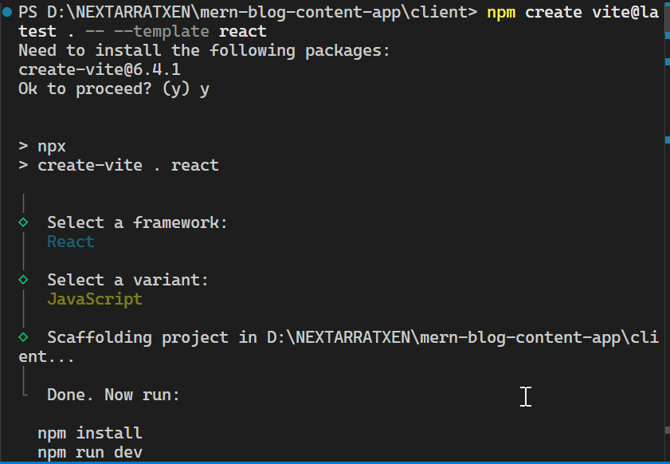
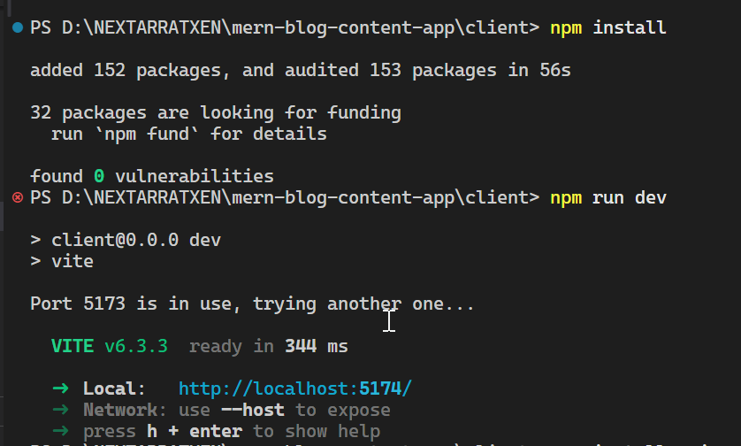
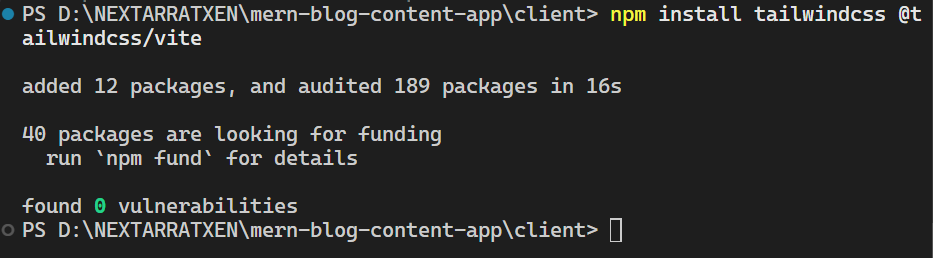
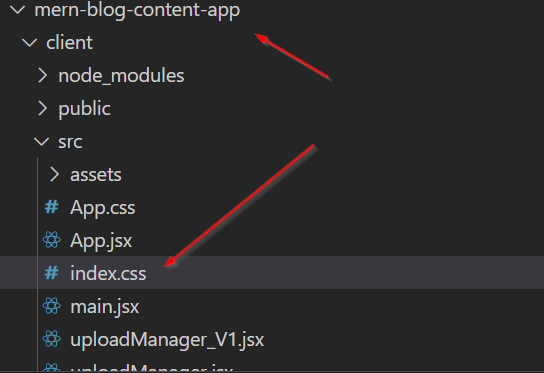
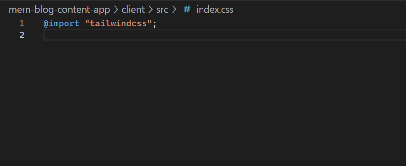
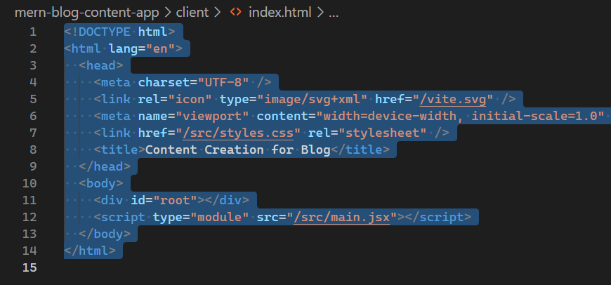
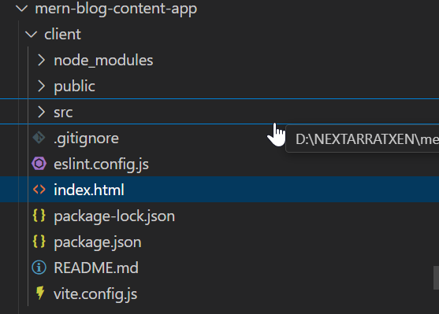
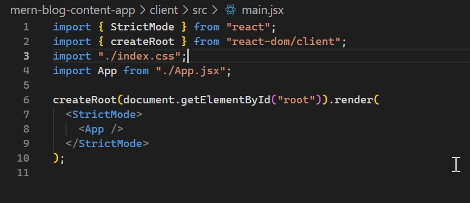
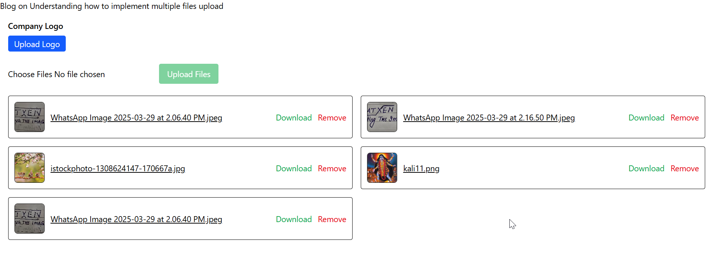

Go to the folder where you would like to do the vite react .

```bash
npm create vite@latest . -- --template react
```

If you want to create a new folder auotmatically then dont use dot (.) but rather you can call like the below

```bash
npm create vite@latest my-react-app -- --template react
```

answer some questions ..



and then

```bash
npm install
```

and then

```bash
npm run dev
```



usually it runs at 5173 port but if any other react app is already running then it will take the 5174 or the next number and so on.

how to install axios

```bash
npm install axios
```

# 3. How to install and configure the tailwind..

[Install and Configure Vite Tailwind css](https://tailwindcss.com/docs/installation/using-vite)

```bash
npm install tailwindcss @tailwindcss/vite
```



and then

```javascript
import { defineConfig } from "vite";
import react from "@vitejs/plugin-react";
import tailwindcss from "@tailwindcss/vite"; // added for tailwind css

// https://vite.dev/config/
export default defineConfig({
  plugins: [
    react(),
    tailwindcss(), // added for tailwind
  ],
});
```

and then

index.css

```css
@import "tailwindcss";
```




and now index.html

```html
<!DOCTYPE html>
<html lang="en">
  <head>
    <meta charset="UTF-8" />
    <link rel="icon" type="image/svg+xml" href="/vite.svg" />
    <meta name="viewport" content="width=device-width, initial-scale=1.0" />
    <link href="/src/styles.css" rel="stylesheet" />
    // added here for tailwind css
    <title>Content Creation for Blog</title>
  </head>
  <body>
    <div id="root"></div>
    <script type="module" src="/src/main.jsx"></script>
  </body>
</html>
```





ensure the index.css is called in main.jsx



and tailwind is now working


